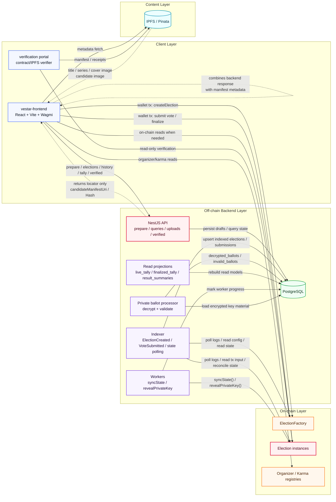

# VESTAr Backend Architecture

발표용 단일 아키텍처 다이어그램이다.  
핵심 메시지는 아래 세 줄이다.

- 프론트는 지갑으로 컨트랙트에 직접 write tx를 보낸다.
- 백엔드는 prepare, indexing, projections, workers를 담당한다.
- 최종 UI는 backend projection + IPFS metadata를 합쳐서 렌더링한다.

## Reading Guide

1. `Frontend` creates manifests and images, uploads them to IPFS, then sends wallet transactions directly to the contracts.
2. `Backend` indexes on-chain events, stores projections in PostgreSQL, and automates state sync / key reveal.
3. `Frontend` renders the final UI by combining backend response fields with IPFS manifest metadata.
