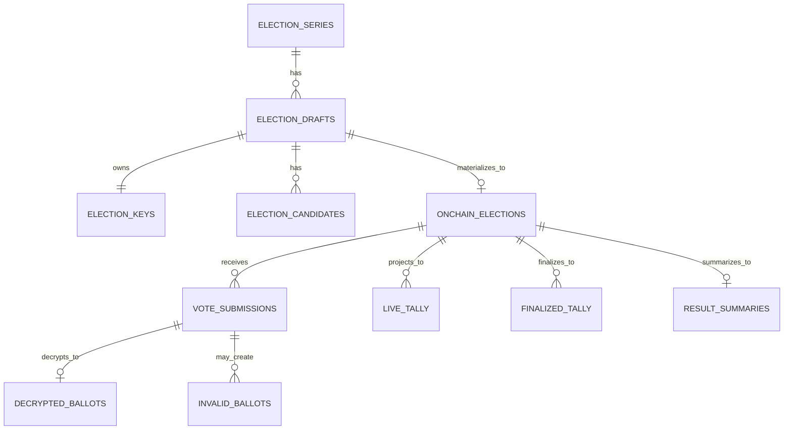

# VESTAr Backend DB Schema

## 목적

이 문서는 현재 `vestar-backend`의 실제 DB 구조를 설명한다.

핵심 원칙:

- `series`는 상위 이벤트/주최 단위다.
- `draft`는 오프체인 준비 단위다.
- `onchain_election`은 실제 컨트랙트 단위다.
- 후보/이미지/원문 메타는 draft에 속한다.
- submission/tally는 on-chain election에 속한다.

## 테이블 목록

- `admin_users`
- `verified_organizers`
- `election_series`
- `election_drafts`
- `election_keys`
- `election_candidates`
- `onchain_elections`
- `vote_submissions`
- `decrypted_ballots`
- `invalid_ballots`
- `live_tally`
- `finalized_tally`
- `result_summaries`
- `indexer_cursors`

## 핵심 컬럼

### `election_series`

- `series_key`
- `onchain_series_id`
- `cover_image_url`

### `election_drafts`

- `series_id`
- `title`
- `cover_image_url`
- `candidate_manifest_preimage`
- `visibility_mode`
- `sync_state`

### `election_keys`

- `draft_id`
- `public_key`
- `private_key_commitment_hash`
- `private_key_encrypted`
- `is_revealed`

### `election_candidates`

- `draft_id`
- `candidate_key`
- `image_url`
- `display_order`

### `onchain_elections`

- `draft_id`
- `onchain_election_id`
- `onchain_election_address`
- `organizer_wallet_address`
- `organizer_verified_snapshot`
- `visibility_mode`
- `payment_mode`
- `ballot_policy`
- `start_at`
- `end_at`
- `result_reveal_at`
- `min_karma_tier`
- `reset_interval_seconds`
- `allow_multiple_choice`
- `max_selections_per_submission`
- `timezone_window_offset`
- `payment_token`
- `cost_per_ballot`
- `onchain_state`

### `vote_submissions`

- `onchain_election_id_ref`
- `onchain_tx_hash`
- `voter_address`
- `block_number`
- `block_timestamp`
- `encrypted_ballot`

### `decrypted_ballots`

- `vote_submission_id`
- `candidate_keys`
- `nonce`
- `is_valid`

## 상태 필드

### `election_drafts.sync_state`

- `PREPARED`
- `INDEXED`
- `EXPIRED`
- `FAILED`

의미:

- `PREPARED`: 원문 저장 및 key 생성 완료
- `INDEXED`: on-chain election과 연결 완료
- `EXPIRED`: 준비 후 일정 시간 내 생성되지 않음
- `FAILED`: prepare 또는 연결 파이프라인 실패

### `onchain_elections.onchain_state`

- `SCHEDULED`
- `ACTIVE`
- `CLOSED`
- `KEY_REVEAL_PENDING`
- `KEY_REVEALED`
- `FINALIZED`
- `CANCELLED`

이 값은 컨트랙트 `ElectionState`를 그대로 반영한다.

## 이미지 저장 규칙

- `election_series.cover_image_url`
  - series 배너 이미지 URL
- `election_drafts.cover_image_url`
  - election 대표 배너 이미지 URL
- `election_candidates.image_url`
  - 후보 이미지 URL

이 이미지 URL들은 DB/UI용 메타데이터다.
현재 `candidateManifestHash` 계산에는 후보 이미지 URL이 포함되지 않는다.

## 관계

