# VESTAr Private Election Architecture

이 문서는 현재 VESTAr 프라이빗 투표 구조가 `RSA로 바로 암호화 후 나중에 개인키로 직접 복호화`하는 구조가 아니라, `ECC(P-256 ECDH) + AES-256-GCM` 하이브리드 구조라는 점을 팀에 설명하기 위한 단일 아키텍처 문서다.

핵심 결론:

- 현재 `frontend-demo`는 `P-256 공개키`를 사용해 `ECDH 공유 비밀`을 만들고, 그 공유 비밀에서 대칭키를 도출해 `AES-GCM`으로 ballot payload를 암호화한다.
- 즉, 포털이 나중에 결과를 독립 검증하려면 `RSA 스타일 직접 복호화`를 기대하면 안 되고, `revealedPrivateKey + encryptedBallot envelope(ephemeralPublicKey, iv, authTag, ciphertext)`를 사용해 같은 공유 비밀을 다시 계산한 뒤 AES-GCM 복호화를 해야 한다.
- 따라서 `vestar-verification-portal`의 기존 구형 compact 포맷 복호화 로직은 현재 시스템과 맞지 않으며, 현행 ECC+AES 포맷에 맞게 바뀌어야 한다.

## 1. 왜 RSA가 아니라 ECC+AES인가

### 1.1 팀이 생각한 구조


이건 RSA 사고방식에 가깝다.

### 1.2 현재 실제 구조

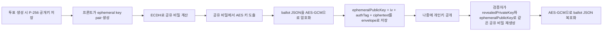

즉 현재 구조는 `ECC로 직접 메시지를 복호화`하는 구조가 아니라, `ECC는 공유 비밀 재생성`, `실제 메시지 암복호화는 AES-GCM`이 담당한다.

### 1.3 왜 이렇게 했는가

- 온체인에 저장하는 공개키 크기를 줄이기 위해
- 브라우저 WebCrypto에서 표준적으로 다루기 쉬운 방식이기 때문에
- RSA보다 공개키가 훨씬 작아서 calldata/storage 비용 측면에서 유리하기 때문에
- 나중에 개인키를 공개했을 때 누구나 동일한 복호화를 재현할 수 있기 때문에

대략 비교:

- RSA 2048 public key: 수백 바이트
- P-256 public key: 수십~100바이트 수준

따라서 이 시스템에서 포털이 바뀌어야 하는 이유는 단순하다.

> 지금 포털은 `RSA처럼 직접 풀리는 구조` 또는 `예전 compact 포맷`을 가정하고 있고, 실제 운영 중인 프론트는 `ECC+AES envelope`를 생성한다.

## 2. 시스템 구성 요소

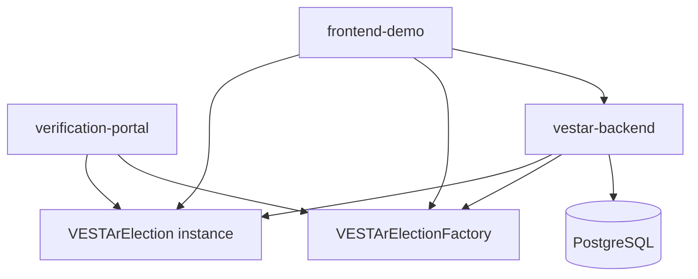

역할 요약:

- `frontend-demo`
  - prepare 호출
  - 이미지 업로드
  - createElection 호출
  - submitEncryptedVote 호출
- `vestar-backend`
  - draft 저장
  - key pair 생성
  - encrypted private key 저장
  - 온체인 인덱싱
  - submission 복호화 및 live tally 집계
  - key reveal 자동화
- `verification-portal`
  - 온체인 이벤트/상태를 읽음
  - 공개된 private key 기준으로 재복호화 및 검증을 수행해야 함
- `Factory`
  - election 인스턴스 생성
- `Election instance`
  - 실제 투표, 상태 전이, private key reveal, result finalize 수행

## 3. 투표 생성 Flow

### 3.1 Sequence

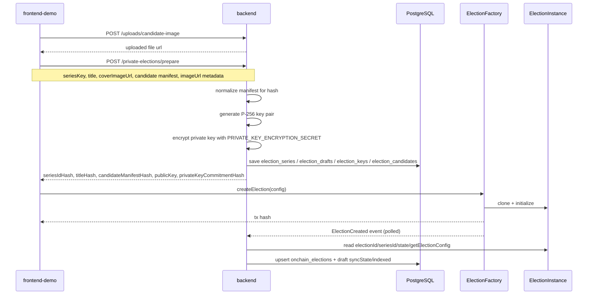

### 3.2 설명

생성 단계는 오프체인 prepare와 온체인 createElection으로 나뉜다.

- prepare는 백엔드가 담당한다.
  - series/draft/candidate/key를 DB에 저장한다.
  - `candidateManifestHash`는 이미지가 제외된 canonical manifest로 계산한다.
  - public key는 프론트가 컨트랙트에 올릴 수 있게 응답한다.
- createElection은 프론트가 factory에 직접 호출한다.
  - 백엔드가 이 tx를 대신 보내지 않는다.
- 이후 인덱서가 factory의 `ElectionCreated`를 polling해 `onchain_elections`를 채운다.

## 4. 투표 Flow

### 4.1 Sequence

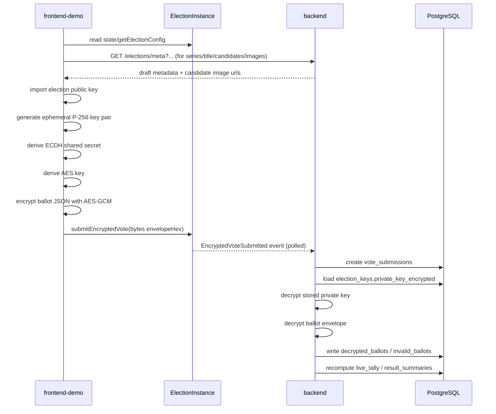

### 4.2 프론트가 실제로 만드는 envelope

현재 `frontend-demo/src/lib/crypto.ts` 기준 envelope:

```json
{
  "algorithm": "ecdh-p256-aes-256-gcm",
  "ephemeralPublicKey": "<base64 spki>",
  "iv": "<base64>",
  "authTag": "<base64>",
  "ciphertext": "<base64>"
}
```

암호화 대상 ballot payload:

```json
{
  "schemaVersion": 1,
  "electionId": "0x...",
  "chainId": 1660990954,
  "electionAddress": "0x...",
  "voterAddress": "0x...",
  "candidateKeys": ["임영웅"],
  "nonce": "0x..."
}
```

이 JSON envelope 전체가 UTF-8 문자열이 되고, 그 문자열이 다시 hex bytes로 바뀌어 `submitEncryptedVote(bytes)`에 들어간다.

## 5. Live Tally Flow

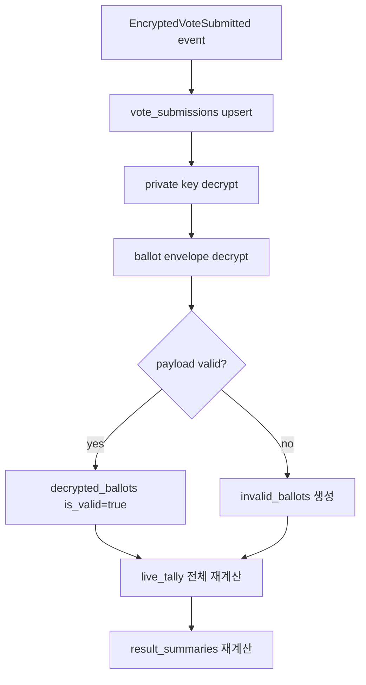

설명:

- `live_tally`는 증분 카운트가 아니라 원본 `decrypted_ballots`를 기준으로 재계산하는 구조다.
- 유효표만 count에 반영된다.
- 프론트의 Live Tally 목록 총 투표수는 현재 `resultSummary`가 아니라 `validDecryptedBallotCount`를 사용하도록 맞춘 상태다.

## 6. Key Reveal Flow

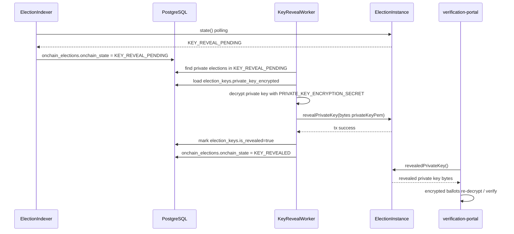

설명:

- 포털은 백엔드에서 private key를 직접 받아서는 안 된다.
- 백엔드는 `KEY_REVEAL_PENDING` 시점에 온체인 `revealPrivateKey(bytes)`만 수행해야 한다.
- 이후 검증 포털은 온체인 `revealedPrivateKey()`만 읽고 자체적으로 복호화해야 한다.

## 7. 인덱서 Flow

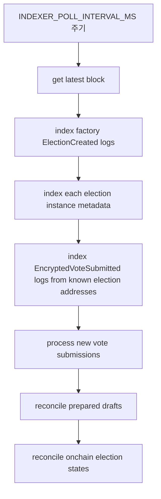

### 7.1 상세 설명

- 팩토리 쪽
  - `ElectionCreated` 이벤트를 polling한다.
  - 읽은 election address마다 `state()`, `getElectionConfig()`를 조회해 `onchain_elections`를 upsert한다.
- 투표 쪽
  - DB에 저장된 private election address들을 대상으로 `EncryptedVoteSubmitted`를 polling한다.
  - tx input을 decode해 `encryptedBallot`을 추출한다.
  - `vote_submissions`를 만들고 곧바로 ballot processor를 태운다.
- 상태 재동기화
  - `onchain_elections.onchain_state`를 주기적으로 다시 읽어 갱신한다.

## 8. API와 DTO 정리

이 섹션은 프론트가 실제로 쓰는 요청/응답 형식을 중심으로 정리했다.

### 8.1 업로드 API

#### `POST /uploads/candidate-image`

설명:

- 후보 이미지나 배너 이미지를 먼저 업로드한다.
- prepare 요청에는 파일 본문이 아니라 URL만 넣는다.

응답 예시:

```json
{
  "url": "http://localhost:3000/uploads/candidate-images/1775565933845-....jpeg"
}
```

### 8.2 Private Election Prepare API

#### `POST /private-elections/prepare`

요청 DTO:

```ts
type PreparePrivateElectionRequest = {
  seriesKey: string;
  seriesCoverImageUrl?: string | null;
  title: string;
  coverImageUrl?: string | null;
  candidateManifestPreimage: {
    candidates: Array<{
      candidateKey: string;
      displayOrder: number;
      imageUrl?: string | null;
    }>;
  };
};
```

응답 DTO:

```ts
type PreparePrivateElectionResponse = {
  seriesIdHash: `0x${string}`;
  titleHash: `0x${string}`;
  candidateManifestHash: `0x${string}`;
  keySchemeVersion: number;
  publicKey: {
    format: "pem";
    algorithm: "ECDH-P256";
    value: string;
  };
  privateKeyCommitmentHash: `0x${string}`;
  candidateManifestPreimage: {
    candidates: Array<{
      candidateKey: string;
      displayOrder: number;
    }>;
  };
};
```

중요:

- 요청의 `imageUrl`은 DB/UI 메타다.
- 응답의 `candidateManifestPreimage`와 DB `candidate_manifest_preimage`는 해시 원본만 남기므로 `imageUrl`이 빠진 canonical manifest여야 한다.

### 8.3 Elections Metadata API

#### `GET /elections/meta`

query:

- `seriesId`
- `onchainElectionId`
- `onchainElectionAddress`
- `syncState`
- `visibilityMode`

설명:

- `Submit Vote`가 온체인 election에 붙일 DB 메타데이터를 가져올 때 사용하는 전용 API다.
- 응답에는 프론트가 DB에서만 얻을 수 있는 메타데이터만 담는다.
- 온체인 상태/기간/정책은 이 API가 아니라 컨트랙트 read 또는 summary API에서 가져온다.

응답 구조:

```ts
type ElectionMetadataByOnchainId = {
  id: string;
  onchainElectionId: string | null;
  onchainElectionAddress: string | null;
  title: string;
  coverImageUrl?: string | null;
  series: {
    id: string;
    seriesKey: string;
    coverImageUrl?: string | null;
  };
  electionKey: {
    publicKey: string;
  } | null;
  electionCandidates: Array<{
    id: string;
    candidateKey: string;
    imageUrl: string | null;
    displayOrder: number;
  }>;
};
```

### 8.4 Elections Summary API

#### `GET /elections`

query:

- `seriesId`
- `onchainElectionId`
- `onchainElectionAddress`
- `syncState`
- `onchainState`
- `visibilityMode`

설명:

- `Live Tally`, `Tally Detail`, 생성 후 인덱싱 확인 같은 화면이 사용하는 summary API다.
- 메타데이터 외에도 organizer, onchain state, 기간, 정책, 유효표 수 등 대시보드용 필드를 포함한다.
- 현재 단계에서는 범용 응답으로 넉넉하게 유지하고, 각 프론트 기능이 필요한 일부만 선택적으로 사용한다.

응답 핵심 구조:

```ts
type IndexedPrivateElection = {
  id: string;
  draftId: string | null;
  onchainElectionId: string;
  onchainElectionAddress: string;
  organizerWalletAddress: string;
  organizerVerifiedSnapshot: boolean;
  visibilityMode: "PRIVATE";
  paymentMode: "FREE" | "PAID";
  ballotPolicy: "ONE_PER_ELECTION" | "ONE_PER_INTERVAL" | "UNLIMITED_PAID";
  startAt: string;
  endAt: string;
  resultRevealAt: string;
  minKarmaTier: number;
  resetIntervalSeconds: number;
  allowMultipleChoice: boolean;
  maxSelectionsPerSubmission: number;
  timezoneWindowOffset: number;
  paymentToken: string | null;
  costPerBallot: string;
  onchainState: string;
  title: string | null;
  coverImageUrl: string | null;
  syncState: string | null;
  series: {
    id: string;
    seriesKey: string;
    onchainSeriesId: string | null;
    coverImageUrl?: string | null;
  } | null;
  electionKey: {
    publicKey: string;
  } | null;
  electionCandidates: Array<{
    id: string;
    candidateKey: string;
    imageUrl: string | null;
    displayOrder: number;
  }>;
  validDecryptedBallotCount: number;
  resultSummary: {
    id: string;
    totalSubmissions: number;
    totalDecryptedBallots: number;
    totalValidVotes: number;
    totalInvalidVotes: number;
    createdAt: string;
  } | null;
};
```

### 8.5 Vote Submission Status API

#### `GET /vote-submissions/by-tx-hash?txHash=0x...`

설명:

- 프론트가 tx hash 기준으로 submission 적재/복호화 상태를 확인할 때 쓴다.

응답 구조:

```ts
type VoteSubmissionStatus = {
  id: string;
  onchainTxHash: string;
  voterAddress: string;
  blockNumber: number;
  blockTimestamp: string;
  onchainElection: {
    id: string;
    onchainElectionId: string;
    onchainElectionAddress: string;
    onchainState: string;
    draft: {
      id: string;
      title: string;
      series: {
        id: string;
        seriesKey: string;
      };
    } | null;
  };
  decryptedBallot: {
    id: string;
    candidateKeys: string[];
    nonce: string;
    isValid: boolean;
    validatedAt: string | null;
    createdAt: string;
  } | null;
  invalidBallots: Array<{
    id: string;
    reasonCode: string;
    reasonDetail: string | null;
    createdAt: string;
  }>;
};
```

### 8.6 Live Tally API

#### `GET /live-tally?electionId=<db onchainElection id>`

응답:

```ts
type LiveTallyRow = {
  id: string;
  onchainElectionId: string;
  candidateKey: string;
  count: number;
  updatedAt: string;
};
```

### 8.7 Finalized Tally API

#### `GET /finalized-tally?electionId=<db onchainElection id>`

응답:

```ts
type FinalizedTallyRow = {
  id: string;
  onchainElectionId: string;
  candidateKey: string;
  count: number;
  voteRatio: number;
  finalizedAt: string;
};
```

### 8.8 Result Summary API

#### `GET /result-summaries?electionId=<db onchainElection id>`

응답:

```ts
type ResultSummary = {
  id: string;
  onchainElectionId: string;
  totalSubmissions: number;
  totalDecryptedBallots: number;
  totalValidVotes: number;
  totalInvalidVotes: number;
  createdAt: string;
};
```

## 9. DB 구조 ERD

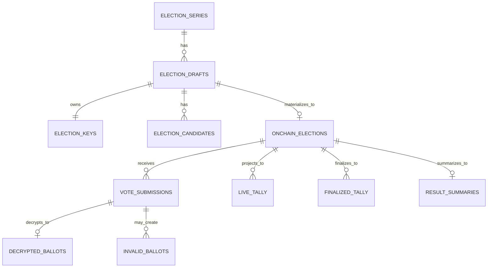

### 9.1 테이블 역할

- `election_series`
  - 시리즈 단위 메타데이터
  - `seriesKey`, `coverImageUrl`, `onchainSeriesId`
- `election_drafts`
  - 오프체인 준비 원본
  - `title`, `coverImageUrl`, `candidateManifestPreimage`, `syncState`
- `election_keys`
  - draft별 공개키 / encrypted private key / commitment
- `election_candidates`
  - 후보 이름, 이미지 URL, displayOrder
- `onchain_elections`
  - 실제 컨트랙트 인스턴스와 매핑되는 row
- `vote_submissions`
  - 온체인 제출 기록
- `decrypted_ballots`
  - 복호화 결과와 유효성 결과
- `invalid_ballots`
  - 무효 사유
- `live_tally`
  - 현재 집계
- `finalized_tally`
  - 최종 집계
- `result_summaries`
  - 요약 수치

## 10. 컨트랙트 구조

### 10.1 Factory와 Election 역할

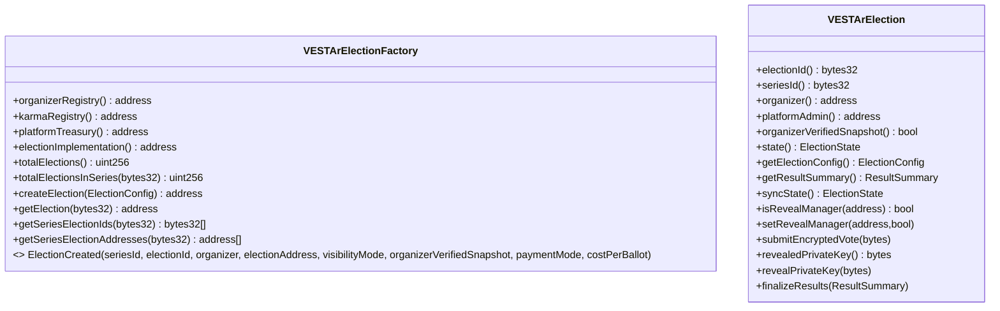

### 10.2 ElectionConfig의 핵심 필드

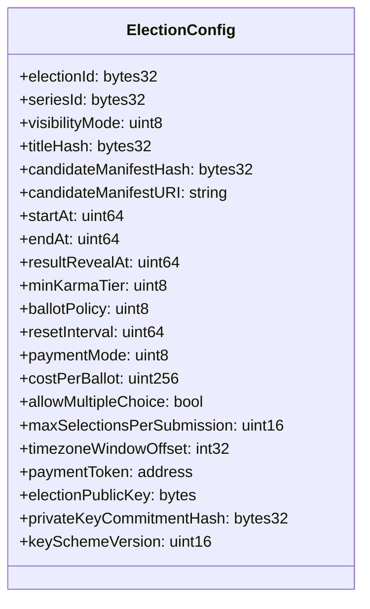

### 10.3 ElectionState

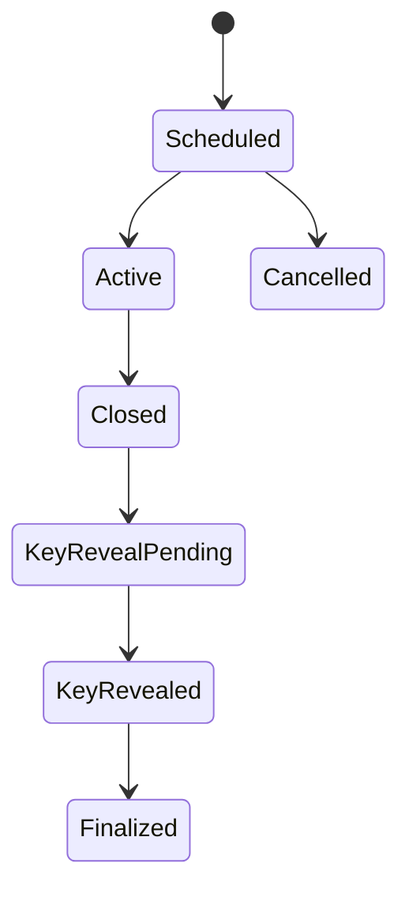

현재 온체인 enum 순서:

- `0 = Scheduled`
- `1 = Active`
- `2 = Closed`
- `3 = KeyRevealPending`
- `4 = KeyRevealed`
- `5 = Finalized`
- `6 = Cancelled`

## 11. 해시와 메타데이터 분리 규칙

이 부분이 중요하다.

### 11.1 온체인 해시 대상

`candidateManifestHash` 계산 대상:

```json
{
  "candidates": [
    {
      "candidateKey": "임영웅",
      "displayOrder": 1
    },
    {
      "candidateKey": "아이유",
      "displayOrder": 2
    }
  ]
}
```

### 11.2 해시 비대상

다음은 DB/UI 메타데이터다.

- `seriesCoverImageUrl`
- `coverImageUrl`
- `election_candidates.image_url`

이 값들은 UI 렌더링용이고, 온체인 hash에 포함되지 않는다.

### 11.3 왜 분리했는가

- 이미지 경로나 CDN이 바뀌어도 온체인 무결성이 깨지지 않게 하기 위해
- 후보 이름/순서 같은 투표 본질 데이터와 UI 자산을 분리하기 위해
- 검증 포털이 결과 검증 시 이미지 URL 같은 비본질 메타데이터에 의존하지 않게 하기 위해

## 12. 포털이 바뀌어야 하는 이유

현재 포털의 문제:

- 구형 compact private ballot 포맷을 기대한다.
- `frontend-demo`가 실제로 올리는 JSON envelope를 해석하지 못한다.
- 따라서 개인키가 온체인에 공개되어도 현재 구조에선 `암호문 풀어 결과 보기`가 제대로 동작하지 않는다.

포털이 해야 할 일:

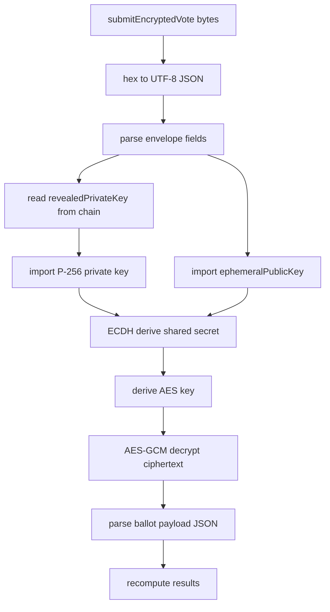

즉 포털이 바뀌어야 하는 포인트는 다음 하나다.

> `RSA식 직접 복호화` 또는 `구형 compact 포맷 복호화`가 아니라, `ECC+AES envelope 복호화`를 구현해야 한다.

## 13. 최종 요약

- 현재 시스템은 `RSA direct encryption` 구조가 아니다.
- 현재 시스템은 `P-256 ECDH + AES-256-GCM` 하이브리드 구조다.
- 백엔드는 prepare 단계에서 키를 생성하고 encrypted private key를 저장한다.
- 프론트는 public key로 ballot JSON을 envelope 형태로 암호화해 온체인에 제출한다.
- 인덱서는 submission을 읽고 백엔드에서 복호화/검증/집계를 수행한다.
- key reveal 시점에는 worker가 개인키를 온체인에 공개한다.
- 검증 포털은 백엔드에 의존하지 않고 온체인 `revealedPrivateKey()`와 `encryptedBallot`만으로 결과를 재계산해야 한다.
- 따라서 포털 복호화 로직은 반드시 현재 ECC+AES 포맷에 맞게 변경되어야 한다.
