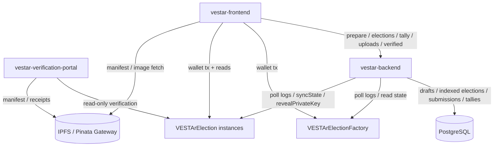
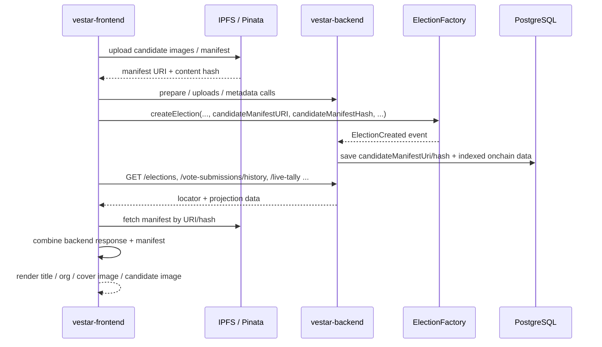
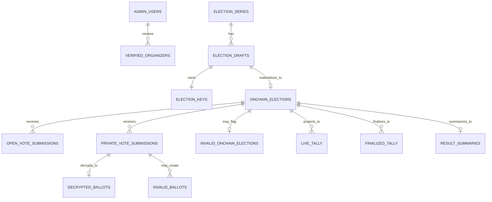
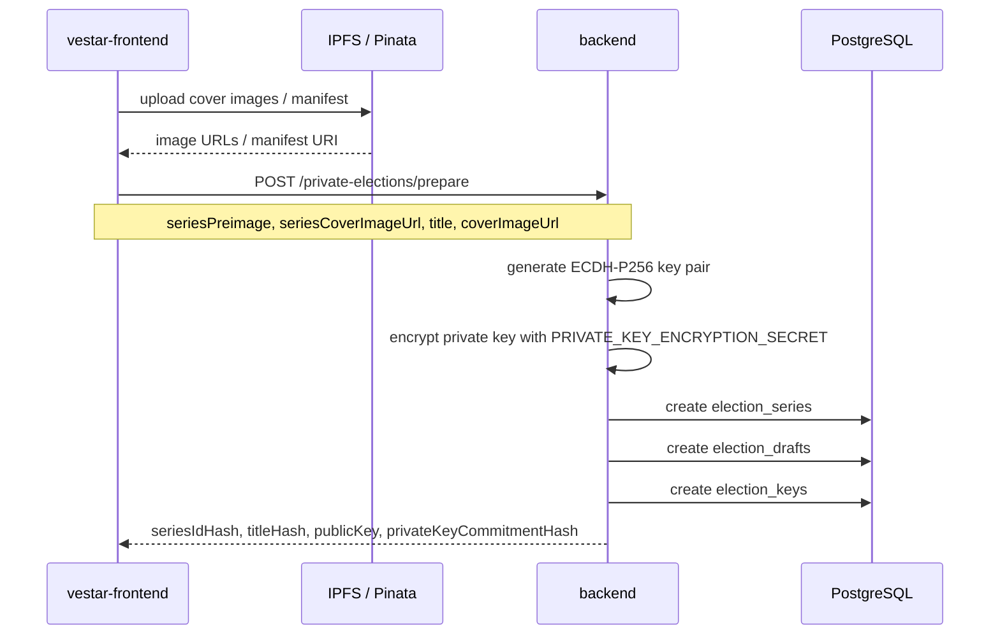
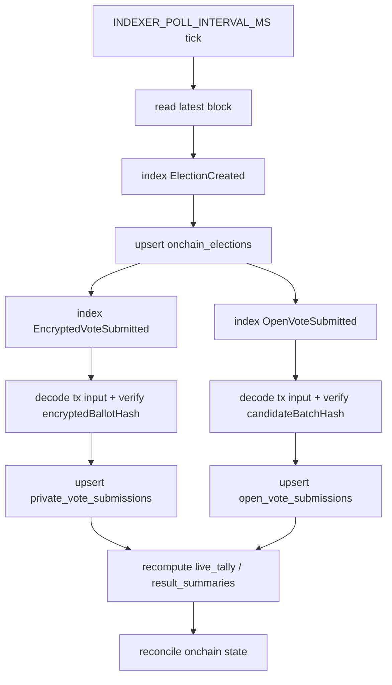
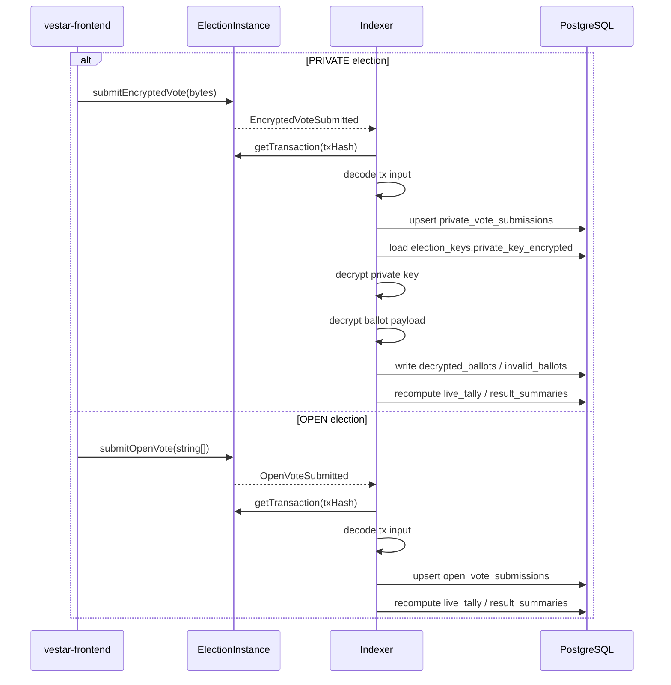
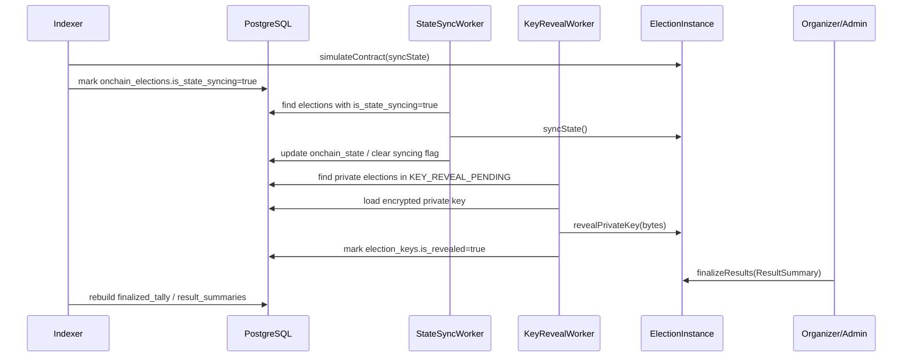

# VESTAr Backend

VESTAr backend is the off-chain coordination layer between the frontend and the contracts. In the current codebase, it focuses on:

- `PRIVATE` election prepare
- On-chain election / submission indexing
- `OPEN` / `PRIVATE` tally projections
- State sync worker
- Private key reveal worker
- Organizer verification / upload / query APIs

Creation, voting, and result-finalization transactions are sent directly from the user's wallet to the contracts, not through the backend.

## Responsibilities

- `vestar-frontend` signs contract write transactions directly.
- The backend handles draft persistence, key material generation, and hash preparation in `POST /private-elections/prepare`.
- The backend uses a polling indexer to track `ElectionCreated`, `EncryptedVoteSubmitted`, `OpenVoteSubmitted`, and state transitions.
- `PRIVATE` submissions are decrypted and validated by the backend.
- `OPEN` submissions are verified against tx input / event consistency, then projections are updated.
- `live_tally`, `finalized_tally`, and `result_summaries` are read-side projections for UI consumption.
- `state-sync-worker` advances on-chain state by calling `syncState()`.
- `key-reveal-worker` calls `revealPrivateKey(bytes)` for private elections in `KEY_REVEAL_PENDING`.
- The verification portal does not treat backend DB data as the source of truth. It reads contracts + IPFS directly.

## System Overview



Key points:

- The contracts are the ultimate source of truth.
- The backend focuses on prepare, indexing, projections, and worker automation.
- Browser calls are restricted by CORS using `FRONTEND_ORIGINS`.

## Manifest / Data Ownership

Election metadata is intentionally split across multiple layers.

- Frontend
  - Builds candidate manifest JSON and image files.
  - Uploads images and manifest to IPFS / Pinata.
  - Sends election creation transactions directly from the wallet.
- Backend
  - Handles `PRIVATE` election prepare, indexing, projections, and operational query APIs.
  - Does not store manifest JSON as the canonical rendering source.
  - Stores locators / projections such as `candidateManifestUri`, `candidateManifestHash`, on-chain state, submissions, and tallies.
- Contracts
  - Hold the authoritative election configuration and result state.
- IPFS
  - Hosts rendering-oriented metadata such as titles, series names, cover images, and candidate images.

Principles:

- The backend is not the layer that assembles final UI strings from manifest content.
- The backend returns manifest locators and minimal verification / projection data.
- Final UI rendering is composed by the frontend using backend responses plus IPFS manifest data.



## Current Modules

Based on `src/app.module.ts`, the currently active modules are:

- `AdminUsersModule`
- `VerifiedOrganizersModule`
- `ElectionsModule`
- `ElectionKeysModule`
- `IndexerModule`
- `VoteSubmissionsModule`
- `DecryptedBallotsModule`
- `InvalidBallotsModule`
- `KeyRevealWorkerModule`
- `LiveTallyModule`
- `FinalizedTallyModule`
- `ResultSummariesModule`
- `StateSyncWorkerModule`
- `PrivateElectionsModule`
- `UploadsModule`
- `PrismaModule`

## Current Data Model

Main models from `prisma/schema.prisma`:

- `admin_users`
- `verified_organizers`
- `election_series`
- `election_drafts`
- `election_keys`
- `onchain_elections`
- `open_vote_submissions`
- `private_vote_submissions`
- `decrypted_ballots`
- `invalid_ballots`
- `invalid_onchain_elections`
- `live_tally`
- `finalized_tally`
- `result_summaries`
- `indexer_cursors`

Core relationships:

- `election_series` 1:N `election_drafts`
- `election_drafts` 1:1 `election_keys`
- `election_drafts` 1:0..1 `onchain_elections`
- `onchain_elections` 1:N `open_vote_submissions`
- `onchain_elections` 1:N `private_vote_submissions`
- `private_vote_submissions` 1:0..1 `decrypted_ballots`
- `private_vote_submissions` 1:N `invalid_ballots`
- `onchain_elections` 1:N `live_tally`
- `onchain_elections` 1:N `finalized_tally`
- `onchain_elections` 1:1 `result_summaries`



Notes:

- The current schema no longer has the old `election_candidates` model.
- Private submission rows are stored in `private_vote_submissions`, not `vote_submissions`.

## Main Flows

### 1. Private election prepare

`POST /private-elections/prepare` is currently minimal. It does not persist the full candidate manifest and does not create dedicated candidate rows.

Currently persisted:

- `election_series`
- `election_drafts`
- `election_keys`

Currently computed:

- `seriesIdHash`
- `titleHash`
- `publicKey`
- `privateKeyCommitmentHash`
- `keySchemeVersion`



### 2. Election indexing

The indexer polls both the factory and election instances, then updates the DB.



### 3. Vote processing



### 3-1. Frontend rendering composition

Frontend screens are not rendered from backend data alone.

- Data provided by the backend
  - on-chain state
  - organizer snapshot
  - submission history
  - tally / result summary
  - `candidateManifestUri`
  - `candidateManifestHash`
- Data enriched from IPFS manifest
  - election title
  - series preimage
  - election cover image
  - series cover image
  - candidate image

Examples:

- `/vote`, `/vote/:id`
  - combine backend election response + manifest to render title, series, cover image, and candidate image
- `/mypage`
  - receive submission / status / invalid reason / manifest locator from `vote-submissions/history`
  - read the manifest again on the frontend to fill title, org, and cover image
- verification portal
  - reads contracts and IPFS directly instead of relying on backend projections

### 3-2. Field-source split by screen

This table summarizes which values come from backend responses and which values are parsed from IPFS manifest.

| Screen | Fields from backend | Fields parsed from IPFS manifest |
| --- | --- | --- |
| `/vote` list | `id`, `onchainElectionId`, `onchainElectionAddress`, `onchainState`, `visibilityMode`, `paymentMode`, `ballotPolicy`, `startAt`, `endAt`, `resultRevealAt`, `participantCount`, `candidateManifestUri`, `candidateManifestHash`, organizer verification snapshot | `title`, `series.preimage`, `election.coverImageUrl`, `series.coverImageUrl`, candidate `imageUrl` |
| `/vote/:id` | election base state, tally/result projections, `candidateManifestUri`, `candidateManifestHash`, submission state | `title`, `series.preimage`, `election.coverImageUrl`, `series.coverImageUrl`, candidate `displayName`, candidate `imageUrl` |
| `/mypage` history | `selection.candidateKeys`, `selection.isPending`, `selection.isValid`, `selection.invalidReason`, `paymentAmount`, `blockTimestamp`, `onchainElection.onchainState`, `candidateManifestUri`, `candidateManifestHash` | `title`, `series.preimage`, `election.coverImageUrl` |
| `/host` / `/host/manage/:id` | organizer-scoped election list, on-chain state, schedule, tally, result summary, `candidateManifestUri`, `candidateManifestHash` | `title`, `series.preimage`, `election.coverImageUrl`, `series.coverImageUrl`, candidate metadata |

Notes:

- The backend returns manifest locators such as `candidateManifestUri` and `candidateManifestHash`, but it does not transform the raw manifest JSON into final presentation strings.
- The frontend uses backend data for state and identity, then enriches title / image fields from the manifest.
- In `/mypage`, `candidateKeys` currently come directly from the backend response, while title / org / cover image are rehydrated from the manifest.

### 4. State sync / key reveal / finalize



## Current `vote-submissions/history` contract

This is the key API used by frontend `/mypage`.

- query
  - `voterAddress`
  - `limit`
  - `cursorTimestamp`
  - `cursorBlockNumber`
  - `cursorId`
- response
  - `items`
  - `nextCursor`
  - `hasMore`

Each item currently includes:

- `type`: `OPEN` | `PRIVATE`
- `onchainTxHash`
- `voterAddress`
- `blockNumber`
- `blockTimestamp`
- `paymentAmount`
- `onchainElection`
  - `id`
  - `onchainElectionId`
  - `onchainElectionAddress`
  - `onchainState`
  - `candidateManifestUri`
  - `candidateManifestHash`
- `selection`
  - `candidateKeys`
  - `isPending`
  - `isValid`
  - `invalidReason`

Note:

- The current `history` query first normalizes the input with `voterAddress.toLowerCase()`, then matches using Prisma `mode: 'insensitive'`.
- In practice, `GET /vote-submissions/history` treats lowercase and mixed-case addresses as the same address.
- Storage paths still do not enforce lowercase normalization by themselves, so other address-based lookups should be reviewed separately for consistency.

## Main API Surface

The endpoints most commonly used by the frontend and operational tools:

- `POST /uploads/candidate-image`
- `POST /private-elections/prepare`
- `GET /elections`
- `GET /elections/:id`
- `GET /elections/meta`
- `GET /elections/revealed-private-key`
- `GET /live-tally`
- `GET /finalized-tally`
- `GET /result-summaries`
- `GET /vote-submissions`
- `GET /vote-submissions/history`
- `GET /vote-submissions/by-tx-hash`
- `GET /verified-organizers`
- `GET /verified-organizers/by-wallet`
- `GET /verified-organizers/request-status`
- `POST /verified-organizers/request`
- `PATCH /verified-organizers/:id/approve`
- `PATCH /verified-organizers/:id/reject`

Notes:

- Endpoints such as `POST /elections` and `PATCH /elections/:id` are mostly internal / operational.
- The verification portal does not depend on these APIs. It reads contracts + IPFS directly.

## Environment Variables

Core environment variables:

- `DATABASE_URL`
- `DATABASE_URL_LOCAL`
- `APP_PORT`
- `FRONTEND_ORIGINS`
- `PRIVATE_KEY_ENCRYPTION_SECRET`
- `INDEXER_RPC_URL`
- `INDEXER_FACTORY_ADDRESS`
- `ORGANIZER_REGISTRY_ADDRESS`
- `INDEXER_START_BLOCK`
- `INDEXER_POLL_INTERVAL_MS`
- `INDEXER_RECONCILE_LOOKBACK_BLOCKS`
- `STATE_SYNC_WORKER_PRIVATE_KEY`
- `KEY_REVEAL_WORKER_PRIVATE_KEY`

Implementation notes:

- DB connection uses `DATABASE_URL` first, then falls back to `DATABASE_URL_LOCAL`.
- Allowed CORS origins are parsed from `FRONTEND_ORIGINS` as a comma-separated list.
- CORS is origin-based, not path-based, so do not include `/vote` paths in this variable.
- `key-reveal-worker` requires `KEY_REVEAL_WORKER_PRIVATE_KEY`.
- `state-sync-worker` falls back to `KEY_REVEAL_WORKER_PRIVATE_KEY` if `STATE_SYNC_WORKER_PRIVATE_KEY` is missing.
- `verified-organizers` calls contract `setVerification()` on approve/reject when `ORGANIZER_REGISTRY_ADDRESS` and a signer private key are available.

Example:

```env
DATABASE_URL="postgresql://..."
APP_PORT=3000
FRONTEND_ORIGINS="http://localhost:5173,https://your-frontend.example.com"
PRIVATE_KEY_ENCRYPTION_SECRET="replace-with-a-long-random-secret"
INDEXER_RPC_URL="https://your-rpc.example.com"
INDEXER_FACTORY_ADDRESS="0x4173b26b14748fe6342b2c444334095ecB7f0854"
ORGANIZER_REGISTRY_ADDRESS="0x31891950a0B5b289fFdA7478DeaE3CED0FB4c4D5"
```

## Running

### Local development

```bash
cp .env.example .env
npm install
docker compose up -d
npx prisma generate
npx prisma db push
npm run start:dev
```

### Production image

- `Dockerfile` uses a multi-stage build.
- `entrypoint.sh` runs `npx prisma migrate deploy` and then starts `node dist/main.js`.

```bash
npm run build
npm run start
```

Notes:

- Local compose only runs PostgreSQL.
- If an existing DB schema still uses old FK naming, `db push` may fail.
- For a clean local reset, `docker compose down -v` is usually the simplest option.

## Frontend Integration Notes

When the frontend deployment URL changes, the backend usually only needs two things:

- add the new origin to `FRONTEND_ORIGINS`
- restart the backend

Examples:

- `http://localhost:5173`
- `https://boisterous-sfogliatella-3e55f2.netlify.app`

Note:

- Do not use the full path like `https://boisterous-sfogliatella-3e55f2.netlify.app/vote`.
- Only the origin, `https://boisterous-sfogliatella-3e55f2.netlify.app`, should be added.

## Related Docs

More detailed docs are available under `../vestar-docs/docs_backend`.

- `BACKEND_ARCHITECTURE.md`
- `DB_SCHEMA.md`
- `ENVIRONMENT_VARIABLES.md`
- `PRIVATE_ELECTION_CREATION_API.md`
- `HASHING_RULES.md`
- `BALLOT_PAYLOAD_V1.md`
- `BALLOT_VALIDATION_RULES.md`
- `TALLY_PIPELINES_SPEC.md`
