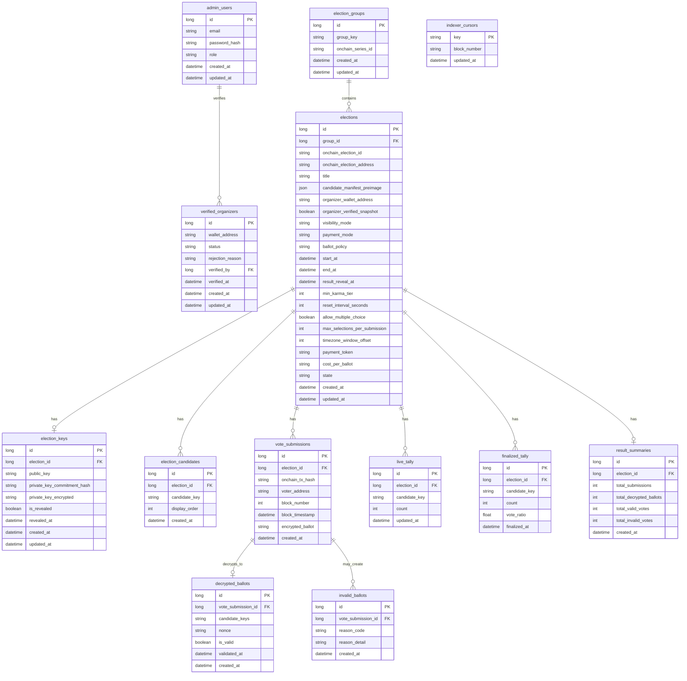

# VESTAr Backend

VESTAr 백엔드는 `PRIVATE` election의 생성 준비, on-chain 인덱싱, ballot 복호화/검증, tally projection을 담당한다.

## 책임 범위

- `OPEN` election tally는 다루지 않는다.
- 프론트는 투표를 컨트랙트로 직접 전송한다.
- 프론트는 private election 생성 전에 해시 원문만 백엔드에 보낸다.
- 백엔드는 `prepare` 단계에서 원문 저장, 후보 파싱 저장, key pair 생성까지 수행한다.
- on-chain election 생성 확인과 submission 적재는 백엔드 인덱서가 수행한다.
- 백엔드는 체인에 실제 포함된 `PRIVATE` submission만 복호화하고 검증한다.
- `live_tally`는 DB 기준 projection이다.
- `finalized_tally`, `result_summaries`는 on-chain election이 최종 상태가 된 뒤 계산한다.

## 현재 흐름

### 1. Private election 생성

1. 프론트가 `POST /private-elections/prepare` 호출
2. 백엔드가 `groupKey`, `title`, `candidateManifestPreimage` 저장
3. 백엔드가 RSA key pair 생성
4. 백엔드가 `publicKey`, `privateKeyCommitmentHash`, 해시값들을 응답
5. 프론트가 organizer 지갑으로 `createElection(...)` 직접 호출
6. 백엔드 인덱서가 `ElectionCreated`를 읽고 `elections`를 확정

### 2. Private vote 처리

1. 유저가 `submitEncryptedVote(...)`를 컨트랙트로 직접 전송
2. 백엔드 인덱서가 `EncryptedVoteSubmitted` 이벤트와 tx calldata를 읽음
3. `vote_submissions` 저장
4. 백엔드가 `private_key_encrypted`를 AES로 복호화해 private key 획득
5. 그 private key로 `encrypted_ballot` 복호화
6. payload 검증 후 `decrypted_ballots` / `invalid_ballots` 저장
7. submission 처리 후 `live_tally`를 election 단위로 재계산
8. on-chain election이 최종 상태가 되면 `finalized_tally`, `result_summaries` 계산

## API

### 프론트가 직접 사용하는 API

#### `POST /private-elections/prepare`

private election 생성 전 준비 API다.

요청 예시:

```json
{
  "groupKey": "mama-17th",
  "title": "MAMA Female Solo",
  "candidateManifestPreimage": {
    "candidates": [
      { "candidateKey": "iu", "displayOrder": 1 },
      { "candidateKey": "taeyeon", "displayOrder": 2 }
    ]
  }
}
```

응답 예시:

```json
{
  "electionId": "1",
  "visibilityMode": "PRIVATE",
  "state": "PREPARED",
  "seriesIdHash": "0x...",
  "titleHash": "0x...",
  "candidateManifestHash": "0x...",
  "keySchemeVersion": 1,
  "publicKey": "-----BEGIN PUBLIC KEY-----\n...\n-----END PUBLIC KEY-----\n",
  "privateKeyCommitmentHash": "0x...",
  "candidateManifestPreimage": {
    "candidates": [
      { "candidateKey": "iu", "displayOrder": 1 },
      { "candidateKey": "taeyeon", "displayOrder": 2 }
    ]
  }
}
```

주의:

- 프론트는 별도 `confirm-onchain` API를 호출하지 않는다.
- on-chain 생성 확인은 백엔드 인덱서가 처리한다.

### 운영/디버깅용 API

현재 도메인 CRUD와 수동 처리 API도 열려 있다.

- `GET /elections`
- `GET /elections/:id`
- `GET /vote-submissions`
- `GET /vote-submissions/:id`
- `POST /vote-submissions/:id/process`
- `POST /vote-submissions/process-pending`
- `GET /live-tally?electionId=<dbElectionId>`
- `GET /finalized-tally?electionId=<dbElectionId>`
- `GET /result-summaries?electionId=<dbElectionId>`

이 API들은 현재 운영/검증 편의를 위한 것이고, 핵심 공개 생성 플로우는 `POST /private-elections/prepare` 하나다.

## 인덱서

현재 인덱서는 두 가지를 담당한다.

- `ElectionCreated` 인덱싱
- `EncryptedVoteSubmitted` 인덱싱

동작:

- RPC로 factory 이벤트와 election 이벤트를 polling한다.
- 마지막 처리 블록은 `indexer_cursors`에 저장한다.
- 최근 블록 재스캔으로 놓친 이벤트를 복구한다.
- `PREPARED` election은 `privateKeyCommitmentHash` 기준으로 on-chain election과 연결한다.

## 환경변수

핵심 환경변수:

- `DATABASE_URL`
- `PRIVATE_KEY_ENCRYPTION_SECRET`
- `APP_PORT`
- `INDEXER_RPC_URL`
- `INDEXER_FACTORY_ADDRESS`
- `INDEXER_START_BLOCK`
- `INDEXER_POLL_INTERVAL_MS`
- `INDEXER_RECONCILE_LOOKBACK_BLOCKS`

자세한 설명은 [ENVIRONMENT_VARIABLES.md](/Users/jeong-yoonho/vscode/Vestar/vestar-backend/ENVIRONMENT_VARIABLES.md) 참고.

## 실행

```bash
cp .env.example .env
docker compose up -d
npx prisma migrate dev --name init
npm run start:dev
```

이미 migration이 있는 상태라 새 환경에서만 초기 실행 시 `migrate dev`를 사용하면 된다.

## 관련 문서

- [DB_SCHEMA.md](/Users/jeong-yoonho/vscode/Vestar/vestar-backend/DB_SCHEMA.md)
- [PRIVATE_ELECTION_CREATION_API.md](/Users/jeong-yoonho/vscode/Vestar/vestar-backend/PRIVATE_ELECTION_CREATION_API.md)
- [HASHING_RULES.md](/Users/jeong-yoonho/vscode/Vestar/vestar-backend/HASHING_RULES.md)
- [BALLOT_PAYLOAD_V1.md](/Users/jeong-yoonho/vscode/Vestar/vestar-backend/BALLOT_PAYLOAD_V1.md)
- [BALLOT_VALIDATION_RULES.md](/Users/jeong-yoonho/vscode/Vestar/vestar-backend/BALLOT_VALIDATION_RULES.md)

## DB Schema


