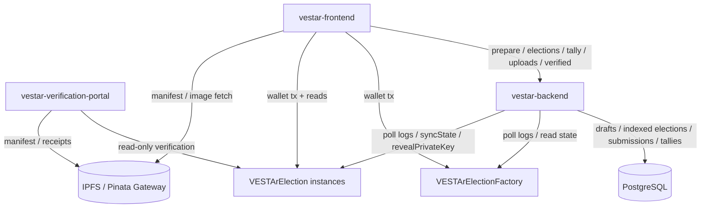
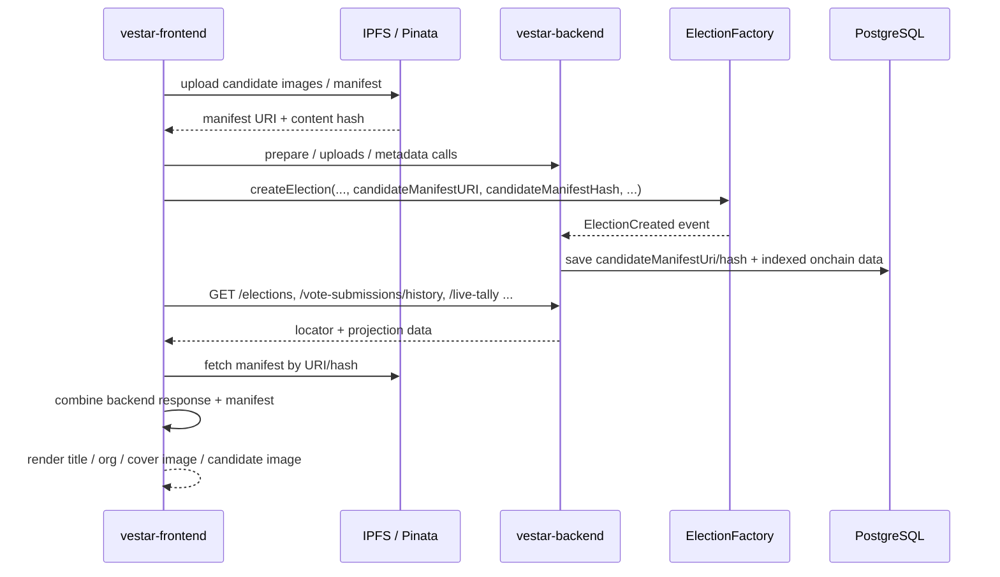
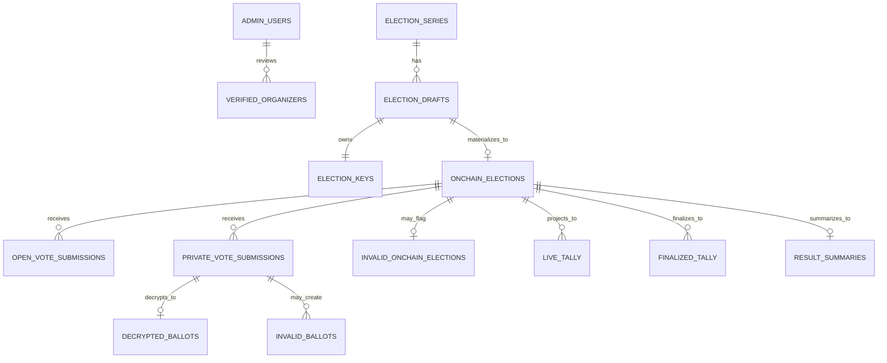
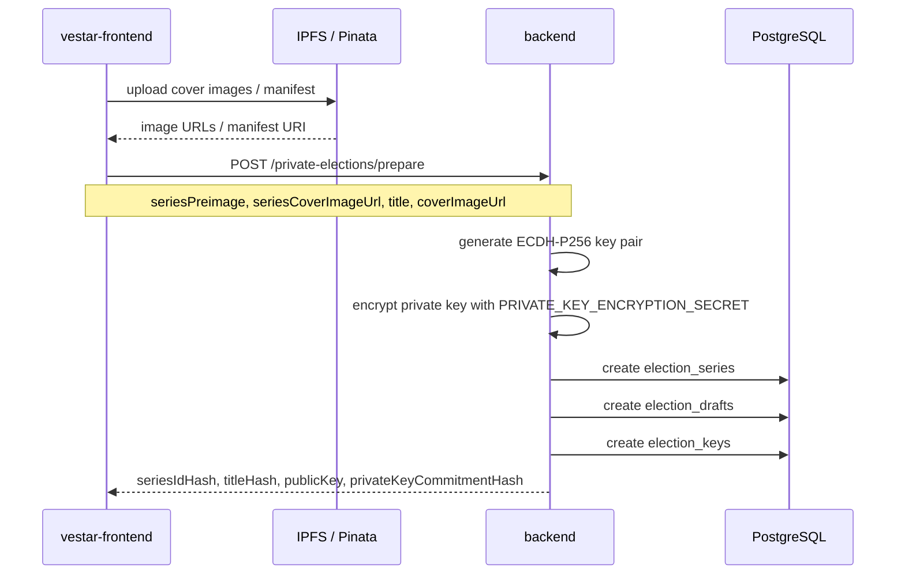
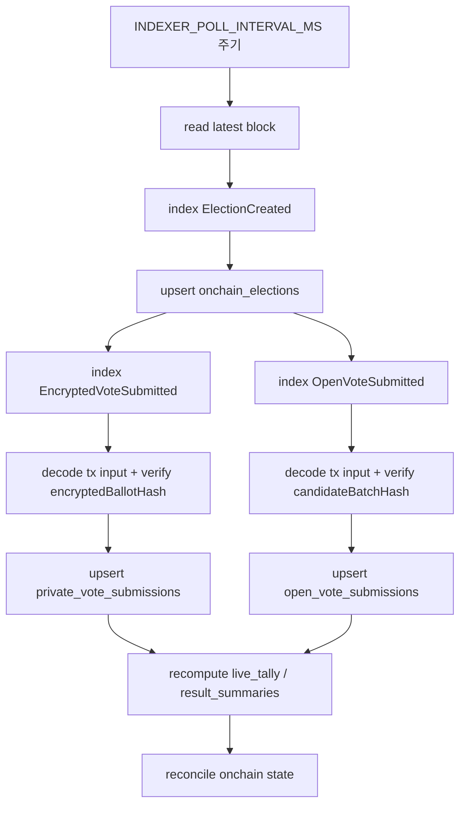
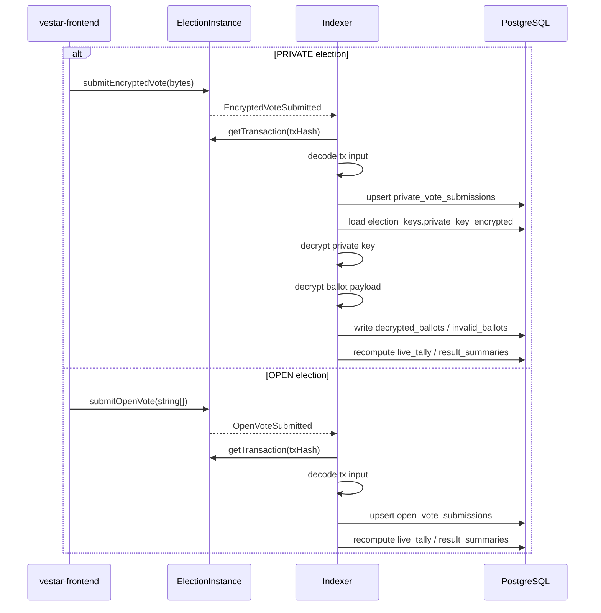
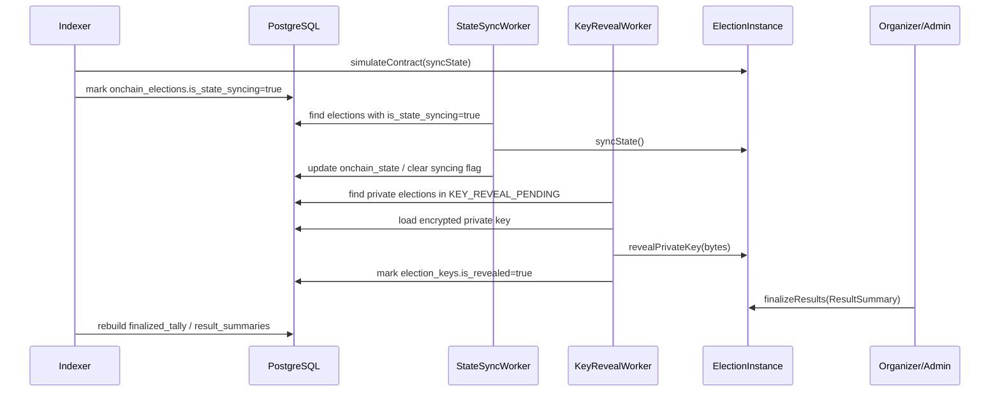

# VESTAr Backend

VESTAr 백엔드는 프론트엔드와 컨트랙트 사이의 오프체인 조정 계층이다. 현재 코드 기준으로 아래 역할에 집중한다.

- `PRIVATE` election prepare
- 온체인 election / submission 인덱싱
- `OPEN` / `PRIVATE` tally projection 생성
- 상태 동기화 worker
- private key reveal worker
- organizer verification / 업로드 / 조회 API 제공

프론트의 생성·투표·결과 확정 트랜잭션은 백엔드를 거치지 않고 지갑에서 컨트랙트로 직접 전송한다.

## 책임 범위

- `vestar-frontend`는 컨트랙트 write tx를 직접 서명한다.
- 백엔드는 `POST /private-elections/prepare`에서 draft, key material, 해시 계산을 담당한다.
- 백엔드는 polling 기반 인덱서로 `ElectionCreated`, `EncryptedVoteSubmitted`, `OpenVoteSubmitted`와 상태 변화를 읽는다.
- `PRIVATE` submission은 백엔드가 복호화하고 검증한다.
- `OPEN` submission은 tx input과 event 정합성 검증 후 projection만 갱신한다.
- `live_tally`, `finalized_tally`, `result_summaries`는 UI용 읽기 projection이다.
- `state-sync-worker`는 `syncState()`를 호출해 온체인 state를 앞으로 진행시킨다.
- `key-reveal-worker`는 `KEY_REVEAL_PENDING` private election에 대해 `revealPrivateKey(bytes)`를 호출한다.
- verification portal은 백엔드 DB를 신뢰 소스로 쓰지 않고 컨트랙트 + IPFS를 직접 읽는다.

## 시스템 구성



핵심 포인트:

- 최종 권위는 온체인 컨트랙트다.
- 백엔드는 prepare, 인덱싱, projection, worker 자동화에 집중한다.
- 브라우저에서 오는 API 호출은 `FRONTEND_ORIGINS` 기반 CORS로 제한한다.

## Manifest / 데이터 소유권

현재 시스템에서 election 메타데이터는 한 군데에만 몰려 있지 않다. 책임이 아래처럼 나뉜다.

- 프론트
  - candidate manifest JSON과 이미지 파일을 만든다.
  - 이미지와 manifest를 IPFS/Pinata에 업로드한다.
  - election 생성 tx를 지갑으로 직접 전송한다.
- 백엔드
  - `PRIVATE` election prepare, 인덱싱, projection, 운영용 조회를 담당한다.
  - manifest 원문을 canonical source로 저장하지 않는다.
  - 대신 `candidateManifestUri`, `candidateManifestHash`, on-chain state, submission, tally 같은 locator / projection 데이터를 저장한다.
- 컨트랙트
  - election 생성 설정과 결과 상태의 최종 권위다.
- IPFS
  - election 제목, 시리즈명, 대표 이미지, 후보 이미지 같은 렌더링용 메타데이터의 배포 위치다.

핵심 원칙:

- 백엔드는 manifest 내용을 직접 조합해서 최종 화면용 문자열을 만들어 주는 계층이 아니다.
- 백엔드는 manifest의 위치와 검증에 필요한 최소 정보만 내려준다.
- 최종 UI 렌더링은 프론트가 백엔드 응답과 IPFS manifest를 합쳐서 만든다.



## 현재 모듈

`src/app.module.ts` 기준으로 현재 활성 모듈은 아래와 같다.

- `AdminUsersModule`
- `VerifiedOrganizersModule`
- `ElectionsModule`
- `ElectionKeysModule`
- `IndexerModule`
- `VoteSubmissionsModule`
- `DecryptedBallotsModule`
- `InvalidBallotsModule`
- `KeyRevealWorkerModule`
- `LiveTallyModule`
- `FinalizedTallyModule`
- `ResultSummariesModule`
- `StateSyncWorkerModule`
- `PrivateElectionsModule`
- `UploadsModule`
- `PrismaModule`

## 현재 데이터 모델

`prisma/schema.prisma` 기준 주요 모델:

- `admin_users`
- `verified_organizers`
- `election_series`
- `election_drafts`
- `election_keys`
- `onchain_elections`
- `open_vote_submissions`
- `private_vote_submissions`
- `decrypted_ballots`
- `invalid_ballots`
- `invalid_onchain_elections`
- `live_tally`
- `finalized_tally`
- `result_summaries`
- `indexer_cursors`

핵심 관계:

- `election_series` 1:N `election_drafts`
- `election_drafts` 1:1 `election_keys`
- `election_drafts` 1:0..1 `onchain_elections`
- `onchain_elections` 1:N `open_vote_submissions`
- `onchain_elections` 1:N `private_vote_submissions`
- `private_vote_submissions` 1:0..1 `decrypted_ballots`
- `private_vote_submissions` 1:N `invalid_ballots`
- `onchain_elections` 1:N `live_tally`
- `onchain_elections` 1:N `finalized_tally`
- `onchain_elections` 1:1 `result_summaries`



주의:

- 현재 스키마에는 예전 문서에 있던 `election_candidates` 모델이 없다.
- private submission 테이블 이름은 `vote_submissions`가 아니라 `private_vote_submissions`다.

## 주요 흐름

### 1. Private election prepare

`POST /private-elections/prepare`는 현재 매우 작다. 후보 manifest 자체를 저장하거나 candidate row를 따로 만들지 않는다.

현재 저장되는 것:

- `election_series`
- `election_drafts`
- `election_keys`

현재 계산되는 값:

- `seriesIdHash`
- `titleHash`
- `publicKey`
- `privateKeyCommitmentHash`
- `keySchemeVersion`



### 2. Election indexing

인덱서는 factory와 election instance를 polling하며 DB를 갱신한다.



### 3. Vote processing



### 3-1. 프론트 렌더링 데이터 조합

현재 프론트 화면은 백엔드만으로 완성되지 않는다. 화면에 따라 아래처럼 데이터를 합쳐 쓴다.

- 백엔드가 주는 것
  - on-chain state
  - organizer snapshot
  - submission history
  - tally / result summary
  - `candidateManifestUri`
  - `candidateManifestHash`
- 프론트가 IPFS manifest에서 보강하는 것
  - election title
  - series preimage
  - election cover image
  - series cover image
  - candidate image

예시:

- `/vote`, `/vote/:id`
  - 백엔드 election 응답 + manifest를 합쳐 제목, 시리즈명, 대표 이미지, 후보 이미지 렌더링
- `/mypage`
  - 백엔드 `vote-submissions/history` 응답에서 submission / status / invalid reason / manifest locator를 받고
  - 프론트가 manifest를 다시 읽어 title, org, 대표 이미지를 채운다
- verification portal
  - 백엔드 projection에 의존하지 않고 컨트랙트와 IPFS를 직접 읽는다

### 3-2. 화면별 필드 소스 구분

아래 표는 프론트가 어떤 값을 백엔드에서 받고, 어떤 값을 IPFS manifest에서 보강하는지 빠르게 확인하기 위한 요약이다.

| 화면 | 백엔드에서 받는 필드 | IPFS manifest에서 파싱하는 필드 |
| --- | --- | --- |
| `/vote` 목록 | `id`, `onchainElectionId`, `onchainElectionAddress`, `onchainState`, `visibilityMode`, `paymentMode`, `ballotPolicy`, `startAt`, `endAt`, `resultRevealAt`, `participantCount`, `candidateManifestUri`, `candidateManifestHash`, organizer verification snapshot | `title`, `series.preimage`, `election.coverImageUrl`, `series.coverImageUrl`, candidate `imageUrl` |
| `/vote/:id` | election 기본 상태값, tally/result 관련 projection, `candidateManifestUri`, `candidateManifestHash`, submission 상태 | `title`, `series.preimage`, `election.coverImageUrl`, `series.coverImageUrl`, candidate `displayName`, candidate `imageUrl` |
| `/mypage` history | `selection.candidateKeys`, `selection.isPending`, `selection.isValid`, `selection.invalidReason`, `paymentAmount`, `blockTimestamp`, `onchainElection.onchainState`, `candidateManifestUri`, `candidateManifestHash` | `title`, `series.preimage`, `election.coverImageUrl` |
| `/host` / `/host/manage/:id` | organizer 기준 election 목록, on-chain state, schedule, tally, result summary, `candidateManifestUri`, `candidateManifestHash` | `title`, `series.preimage`, `election.coverImageUrl`, `series.coverImageUrl`, candidate 메타데이터 |

주의:

- 백엔드는 manifest locator인 `candidateManifestUri`, `candidateManifestHash`를 내려주지만, 그 원문 JSON을 직접 최종 렌더링용으로 가공해서 반환하지는 않는다.
- 프론트는 백엔드 응답으로 상태와 식별자를 받고, manifest에서 제목/이미지 계열 필드를 보강한다.
- `/mypage`의 선택값(`candidateKeys`)은 현재 백엔드 응답값을 그대로 사용하고, title / org / cover image만 manifest에서 채운다.

### 4. State sync / key reveal / finalize



## 현재 `vote-submissions/history` 계약

프론트 `mypage`가 직접 참조하는 중요한 API다.

- query
  - `voterAddress`
  - `limit`
  - `cursorTimestamp`
  - `cursorBlockNumber`
  - `cursorId`
- response
  - `items`
  - `nextCursor`
  - `hasMore`

각 item에는 현재 아래 정보가 들어간다.

- `type`: `OPEN` | `PRIVATE`
- `onchainTxHash`
- `voterAddress`
- `blockNumber`
- `blockTimestamp`
- `paymentAmount`
- `onchainElection`
  - `id`
  - `onchainElectionId`
  - `onchainElectionAddress`
  - `onchainState`
  - `candidateManifestUri`
  - `candidateManifestHash`
- `selection`
  - `candidateKeys`
  - `isPending`
  - `isValid`
  - `invalidReason`

주의:

- 현재 `history` 조회는 먼저 `voterAddress.toLowerCase()`로 입력을 정규화한 뒤, Prisma `mode: 'insensitive'` 비교로 매칭한다.
- 즉 `GET /vote-submissions/history` 경로는 lowercase / mixed-case 주소를 모두 같은 주소로 취급한다.
- 다만 저장 경로 자체는 별도 lowercase 정규화를 강제하지 않으므로, 다른 주소 기반 조회도 같은 정책으로 맞출지는 별도 점검이 필요하다.

## 주요 API Surface

프론트와 운영 도구가 현재 주로 참조하는 엔드포인트:

- `POST /uploads/candidate-image`
- `POST /private-elections/prepare`
- `GET /elections`
- `GET /elections/:id`
- `GET /elections/meta`
- `GET /elections/revealed-private-key`
- `GET /live-tally`
- `GET /finalized-tally`
- `GET /result-summaries`
- `GET /vote-submissions`
- `GET /vote-submissions/history`
- `GET /vote-submissions/by-tx-hash`
- `GET /verified-organizers`
- `GET /verified-organizers/by-wallet`
- `GET /verified-organizers/request-status`
- `POST /verified-organizers/request`
- `PATCH /verified-organizers/:id/approve`
- `PATCH /verified-organizers/:id/reject`

주의:

- `POST /elections`, `PATCH /elections/:id` 같은 일부 엔드포인트는 내부 운영/보정용 성격이 강하다.
- verification portal은 위 API에 의존하지 않고 컨트랙트 + IPFS를 직접 읽는다.

## 환경변수

핵심 환경변수:

- `DATABASE_URL`
- `DATABASE_URL_LOCAL`
- `APP_PORT`
- `FRONTEND_ORIGINS`
- `PRIVATE_KEY_ENCRYPTION_SECRET`
- `INDEXER_RPC_URL`
- `INDEXER_FACTORY_ADDRESS`
- `ORGANIZER_REGISTRY_ADDRESS`
- `INDEXER_START_BLOCK`
- `INDEXER_POLL_INTERVAL_MS`
- `INDEXER_RECONCILE_LOOKBACK_BLOCKS`
- `STATE_SYNC_WORKER_PRIVATE_KEY`
- `KEY_REVEAL_WORKER_PRIVATE_KEY`

현재 코드 기준 메모:

- DB 연결은 `DATABASE_URL` 우선, 없으면 `DATABASE_URL_LOCAL` fallback으로 읽는다.
- CORS 허용 origin은 `FRONTEND_ORIGINS`에서 쉼표 구분으로 읽는다.
- CORS는 path가 아니라 origin 기준이므로 `/vote` 경로까지 넣지 않는다.
- `key-reveal-worker`는 `KEY_REVEAL_WORKER_PRIVATE_KEY`가 필요하다.
- `state-sync-worker`는 `STATE_SYNC_WORKER_PRIVATE_KEY`가 없으면 `KEY_REVEAL_WORKER_PRIVATE_KEY`를 fallback으로 쓴다.
- `verified-organizers`는 `ORGANIZER_REGISTRY_ADDRESS`와 signer private key가 있으면 approve/reject 시 컨트랙트 `setVerification()`도 호출한다.

예시:

```env
DATABASE_URL="postgresql://..."
APP_PORT=3000
FRONTEND_ORIGINS="http://localhost:5173,https://your-frontend.example.com"
PRIVATE_KEY_ENCRYPTION_SECRET="replace-with-a-long-random-secret"
INDEXER_RPC_URL="https://your-rpc.example.com"
INDEXER_FACTORY_ADDRESS="0x4173b26b14748fe6342b2c444334095ecB7f0854"
ORGANIZER_REGISTRY_ADDRESS="0x31891950a0B5b289fFdA7478DeaE3CED0FB4c4D5"
```

## 실행

### 로컬 개발

```bash
cp .env.example .env
npm install
docker compose up -d
npx prisma generate
npx prisma db push
npm run start:dev
```

### 프로덕션 이미지

- `Dockerfile`은 multi-stage build를 사용한다.
- 컨테이너 시작 시 `entrypoint.sh`에서 `npx prisma migrate deploy` 후 `node dist/main.js`를 실행한다.

```bash
npm run build
npm run start
```

주의:

- 로컬 compose는 PostgreSQL만 띄운다.
- 기존 스키마와 현재 FK 이름이 다르면 `db push`가 실패할 수 있다.
- 완전히 새로 시작할 때는 `docker compose down -v` 후 다시 올리는 쪽이 가장 단순하다.

## 프론트 연결 메모

현재 프론트 배포 주소가 바뀌면 보통 백엔드에서 확인할 것은 아래 두 가지다.

- `FRONTEND_ORIGINS`에 새 origin 추가
- 백엔드 재시작

예시:

- `http://localhost:5173`
- `https://boisterous-sfogliatella-3e55f2.netlify.app`

주의:

- `https://boisterous-sfogliatella-3e55f2.netlify.app/vote` 전체가 아니라 origin인 `https://boisterous-sfogliatella-3e55f2.netlify.app`만 넣는다.

## 관련 문서

상세 문서는 `../vestar-docs/docs_backend`를 참고한다.

- `BACKEND_ARCHITECTURE.md`
- `DB_SCHEMA.md`
- `ENVIRONMENT_VARIABLES.md`
- `PRIVATE_ELECTION_CREATION_API.md`
- `HASHING_RULES.md`
- `BALLOT_PAYLOAD_V1.md`
- `BALLOT_VALIDATION_RULES.md`
- `TALLY_PIPELINES_SPEC.md`
