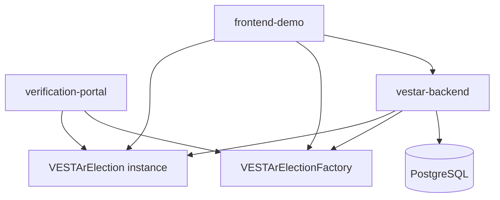
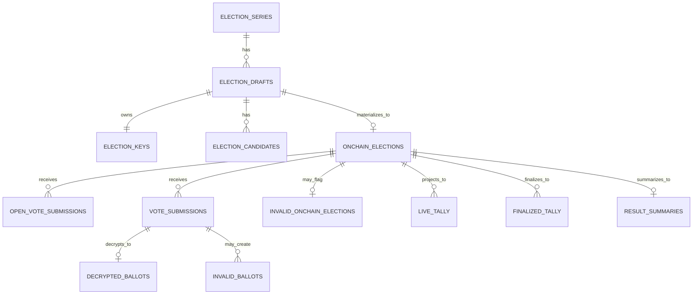
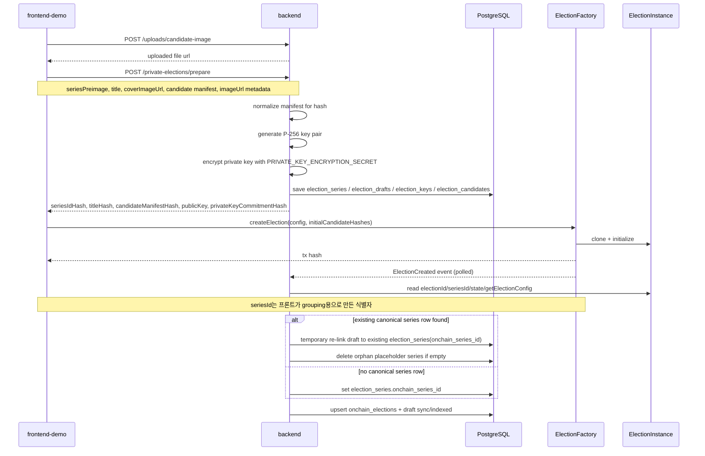
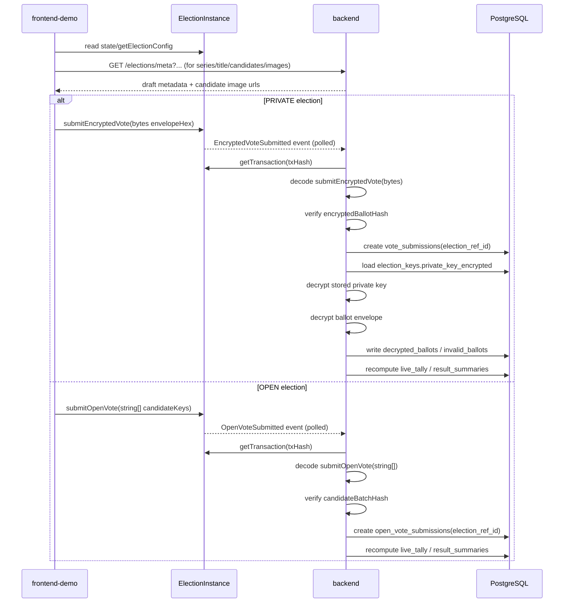
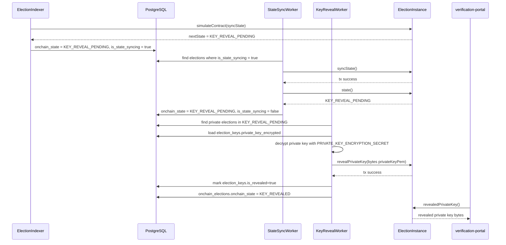
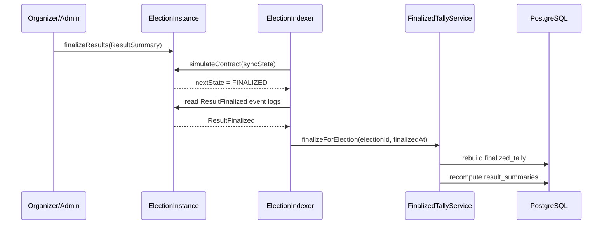
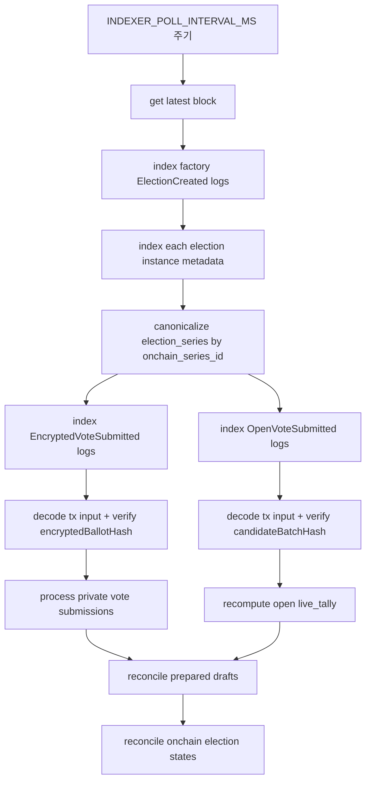

# VESTAr Backend

VESTAr 백엔드는 `PRIVATE` election prepare, on-chain indexer, `OPEN` / `PRIVATE` tally projection, state sync worker, key reveal worker를 담당한다.

## 책임 범위

- 프론트는 `createElection(config, initialCandidateHashes)`, `submitEncryptedVote(...)`, `submitOpenVote(...)`, `finalizeResults(...)`를 컨트랙트로 직접 전송한다.
- 백엔드는 `PRIVATE` election의 `prepare` 단계에서 draft 저장, key pair 생성, 해시 계산을 수행한다.
- 백엔드는 `ElectionCreated`, `EncryptedVoteSubmitted`, `OpenVoteSubmitted`를 polling 인덱싱한다.
- 백엔드는 `PRIVATE` ballot만 복호화하고 검증한다.
- `live_tally`, `finalized_tally`, `result_summaries`는 DB projection이다.
- 시간 기반 상태 전이는 인덱서가 감지하고 `state-sync-worker`가 `syncState()` tx를 보낸다.
- `PRIVATE` election의 key reveal은 `key-reveal-worker`가 `revealPrivateKey(bytes)` tx를 보낸다.

## 시스템 구성 요소



## 현재 데이터 모델

- `election_series`
  - 상위 시리즈 단위
  - `series_preimage`, `onchain_series_id`, `cover_image_url`
  - `seriesId`는 프론트가 시리즈 단위 grouping을 위해 만드는 식별자다
  - 현재 인덱서의 canonical series merge는 기존 placeholder/private prepare row 충돌을 피하기 위한 임시 보정 로직이다
- `election_drafts`
  - 오프체인 prepare 단위
  - `title`, `cover_image_url`, `candidate_manifest_preimage`, `sync_state`
- `election_keys`
  - draft별 공개키 / private key commitment / encrypted private key
- `election_candidates`
  - draft별 후보 목록
  - `candidate_key`, `image_url`, `display_order`
- `onchain_elections`
  - 실제 컨트랙트 단위
  - `onchain_series_id`, `onchain_election_id`, `onchain_election_address`, `onchain_state`
  - `is_state_syncing`, `last_state_sync_requested_at`, `last_state_sync_tx_hash`
- `invalid_onchain_elections`
  - draft 매핑 실패 같은 인덱싱 예외 기록
- `open_vote_submissions`
  - `OPEN` election 전용 submission
  - 내부 FK는 `election_ref_id`
- `vote_submissions`
  - `PRIVATE` election 전용 encrypted submission
  - 내부 FK는 `election_ref_id`
- `decrypted_ballots`
- `invalid_ballots`
- `live_tally`
- `finalized_tally`
- `result_summaries`
- `indexer_cursors`

핵심 관계:

- `election_series` 1:N `election_drafts`
- `election_drafts` 1:1 `election_keys`
- `election_drafts` 1:N `election_candidates`
- `election_drafts` 1:0..1 `onchain_elections`
- `onchain_elections` 1:N `open_vote_submissions`
- `onchain_elections` 1:N `vote_submissions`
- `open_vote_submissions.election_ref_id`, `vote_submissions.election_ref_id`, `live_tally.election_ref_id`, `finalized_tally.election_ref_id`, `result_summaries.election_ref_id`는 모두 `onchain_elections.id`를 가리키는 내부 FK다.
- 실제 온체인 `bytes32` 식별자는 `onchain_elections.onchain_election_id`에 저장된다.



## 현재 흐름

### 1. Private election 생성



1. 프론트가 `POST /private-elections/prepare` 호출
2. 백엔드가 `election_series`, `election_drafts`, `election_candidates`, `election_keys` 저장
3. 백엔드가 `seriesIdHash`, `titleHash`, `candidateManifestHash`, `publicKey`, `privateKeyCommitmentHash` 응답
4. 프론트가 organizer 지갑으로 `createElection(config, initialCandidateHashes)` 직접 호출
5. 백엔드 인덱서가 `ElectionCreated`를 읽고 `onchain_elections`를 확정
6. 이미 같은 `onchain_series_id`를 가진 `election_series` row가 있으면 draft를 그 row로 재연결하고, 비어버린 placeholder series row는 정리한다
7. 이 canonical merge는 현재 DB 충돌 회피용 임시 보정이며, 장기적으로는 프론트의 `seriesId` 생성 규칙이 더 중요하다

### 2. Open / Private vote 처리



- `PRIVATE`
  1. 유저가 `submitEncryptedVote(...)`를 컨트랙트로 직접 전송
  2. 백엔드 인덱서가 `EncryptedVoteSubmitted` 이벤트와 tx input을 읽고 `encryptedBallotHash` 정합성을 대조함
  3. `vote_submissions` 저장
  4. 백엔드가 `election_keys.private_key_encrypted`를 `PRIVATE_KEY_ENCRYPTION_SECRET`로 복호화
  5. 복호화한 private key로 `ECDH-P256 + AES-256-GCM` ballot envelope 복호화
  6. payload 검증 후 `decrypted_ballots` / `invalid_ballots` 저장
  7. `live_tally`, `result_summaries` 재계산
- `OPEN`
  1. 유저가 `submitOpenVote(...)`를 컨트랙트로 직접 전송
  2. 백엔드 인덱서가 `OpenVoteSubmitted` 이벤트와 tx input을 읽고 `candidateBatchHash` 정합성을 대조함
  3. `open_vote_submissions` 저장
  4. `live_tally`, `result_summaries` 재계산

### 2-1. Live tally 계산

```mermaid
flowchart TD
  A{visibilityMode}
  A -- PRIVATE --> B[EncryptedVoteSubmitted]
  B --> C[vote_submissions upsert]
  C --> D[private key decrypt]
  D --> E[ballot envelope decrypt]
  E --> F{payload valid?}
  F -- yes --> G[decrypted_ballots is_valid=true]
  F -- no --> H[invalid_ballots 생성]
  G --> I[live_tally 전체 재계산]
  H --> I
  A -- OPEN --> J[OpenVoteSubmitted]
  J --> K[getTransaction(txHash)]
  K --> L[decode submitOpenVote(string[])]
  L --> M[open_vote_submissions upsert]
  M --> I
  I --> N[result_summaries 재계산]
```

### 3. 상태 동기화와 후처리





- 인덱서는 `syncState()` 결과를 off-chain으로 계산해 상태 변화가 필요하면 `onchain_elections.is_state_syncing = true`로 표시한다.
- `state-sync-worker`는 운영 지갑으로 `syncState()` tx를 보내 on-chain storage state를 맞춘다.
- `PRIVATE` election이 `KEY_REVEAL_PENDING` 이 되면 `key-reveal-worker`가 `revealPrivateKey(bytes)` tx를 보낸다.
- organizer/admin이 온체인 `finalizeResults(ResultSummary)`를 호출하면 인덱서가 `FINALIZED`를 감지하고 `finalized_tally`를 생성한다.

### 3-1. ElectionState

```mermaid
flowchart TD
  A[Scheduled] -->|timestamp >= startAt| B[Active]
  B -->|timestamp >= endAt| C{visibilityMode}
  C -->|OPEN| D[Closed]
  C -->|PRIVATE and resultRevealAt not reached| E[Closed]
  C -->|PRIVATE and resultRevealAt reached| F[KeyRevealPending]
  E -->|timestamp >= resultRevealAt| F
  F -->|revealedPrivateKey set| G[KeyRevealed]
  D -->|finalizeResults(ResultSummary)| H[Finalized]
  G -->|finalizeResults(ResultSummary)| H
  A --> I[Cancelled]
  B --> I
  D --> I
  E --> I
  F --> I
  G --> I
```

## 인덱서 Flow



## Prepare API

### `POST /private-elections/prepare`

요청 예시:

```json
{
  "seriesPreimage": "SHOW ME THE MONEY 12",
  "seriesCoverImageUrl": "http://localhost:3000/uploads/candidate-images/smtm12-banner.jpg",
  "title": "SMTM12 FINAL STAGE",
  "coverImageUrl": "http://localhost:3000/uploads/candidate-images/smtm12-final-stage.jpg",
  "candidateManifestPreimage": {
    "candidates": [
      {
        "candidateKey": "임영웅",
        "displayOrder": 1,
        "imageUrl": "http://localhost:3000/uploads/candidate-images/candidate-1.jpg"
      },
      {
        "candidateKey": "아이유",
        "displayOrder": 2,
        "imageUrl": "http://localhost:3000/uploads/candidate-images/candidate-2.jpg"
      }
    ]
  }
}
```

응답 예시:

```json
{
  "seriesIdHash": "0x...",
  "titleHash": "0x...",
  "candidateManifestHash": "0x...",
  "keySchemeVersion": 1,
  "publicKey": {
    "format": "pem",
    "algorithm": "ECDH-P256",
    "value": "-----BEGIN PUBLIC KEY-----\n...\n-----END PUBLIC KEY-----\n"
  },
  "privateKeyCommitmentHash": "0x...",
  "candidateManifestPreimage": {
    "candidates": [
      {
        "candidateKey": "임영웅",
        "displayOrder": 1
      },
      {
        "candidateKey": "아이유",
        "displayOrder": 2
      }
    ]
  }
}
```

주의:

- `seriesCoverImageUrl`, `coverImageUrl`, candidate `imageUrl`은 DB/UI용 메타데이터다.
- `candidateManifestHash` 계산에는 candidate `imageUrl`이 포함되지 않는다.
- on-chain 생성 확인은 별도 confirm API가 아니라 인덱서가 수행한다.

## 인덱서와 워커

현재 백엔드는 polling 기반이다.

- factory의 `ElectionCreated` 이벤트 polling
- known election addresses의 `EncryptedVoteSubmitted` 이벤트 polling
- known election addresses의 `OpenVoteSubmitted` 이벤트 polling
- `simulateContract(syncState)` 기반 상태 변화 감지
- `state-sync-worker`의 `syncState()` write tx
- `key-reveal-worker`의 `revealPrivateKey(bytes)` write tx
- 마지막 처리 블록은 `indexer_cursors`에 저장

## 환경변수

핵심 환경변수:

- `DATABASE_URL`
- `PRIVATE_KEY_ENCRYPTION_SECRET`
- `APP_PORT`
- `INDEXER_RPC_URL`
- `INDEXER_FACTORY_ADDRESS`
- `INDEXER_START_BLOCK`
- `INDEXER_POLL_INTERVAL_MS`
- `INDEXER_RECONCILE_LOOKBACK_BLOCKS`
- `STATE_SYNC_WORKER_PRIVATE_KEY`
- `KEY_REVEAL_WORKER_PRIVATE_KEY`

자세한 설명은 `../vestar-docs/docs_backend/ENVIRONMENT_VARIABLES.md` 참고.

## 실행

```bash
cp .env.example .env
npm install
docker compose up -d
npx prisma generate
npx prisma db push
npm run start:dev
```

주의:

- 이번 스키마 기준으로 내부 FK 컬럼명이 `election_ref_id`로 바뀌었으므로, 기존 DB를 그대로 쓰는 경우 `npx prisma db push`가 실패할 수 있다.
- 새로 시작할 경우 `npx prisma db push --force-reset` 또는 `docker compose down -v` 후 재기동이 가장 단순하다.

## 관련 문서

백엔드 상세 문서는 `../vestar-docs/docs_backend`에 있다.

- `BACKEND_ARCHITECTURE.md`
- `PRIVATE_ELECTION_ECC_ARCHITECTURE.md`
- `DB_SCHEMA.md`
- `ENVIRONMENT_VARIABLES.md`
- `PRIVATE_ELECTION_CREATION_API.md`
- `HASHING_RULES.md`
- `BALLOT_PAYLOAD_V1.md`
- `BALLOT_VALIDATION_RULES.md`
- `TALLY_PIPELINES_SPEC.md`
