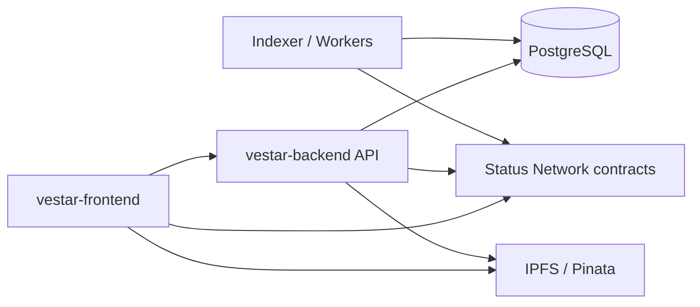
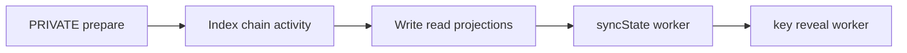

<p align="center">
  
</p>

<p align="center">
  
</p>

# VESTAr Backend

Backend services for VESTAr's private election preparation, onchain indexing, tally projections, and automated reveal/state-sync operations.

<p align="center">
  <a href="https://github.com/VESTAr-BAY/vestar-frontend">Frontend</a>
  ·
  <a href="https://github.com/VESTAr-BAY/vestar-contracts">Contracts</a>
  ·
  <a href="https://boisterous-sfogliatella-3e55f2.netlify.app/vote/">Live Demo</a>
</p>

## Related Repositories

| Repository | How it connects to this backend |
| --- | --- |
| [`vestar-backend`](https://github.com/VESTAr-BAY/vestar-backend) | Offchain coordination layer for indexing, read APIs, workers, and private vote preparation |
| [`vestar-frontend`](https://github.com/VESTAr-BAY/vestar-frontend) | Calls this backend for indexed reads, private election preparation, uploads, and organizer flows |
| [`vestar-contracts`](https://github.com/VESTAr-BAY/vestar-contracts) | Defines the onchain factory and election runtime that this backend reads from and automates around |

## Overview

**English**  
This repository is the offchain coordination layer of VESTAr. It does not relay wallet transactions for vote creation or ballot submission. Instead, it prepares private elections, indexes contract events, builds API-friendly projections, and runs workers that keep election state moving forward.

**한국어**  
이 저장소는 VESTAr의 오프체인 조정 계층입니다. 투표 생성이나 투표 제출 트랜잭션을 대신 중계하지는 않습니다. 대신 비공개 투표 준비, 컨트랙트 이벤트 인덱싱, 프론트엔드용 읽기 데이터 구성, 그리고 election 상태를 자동으로 전진시키는 worker 역할을 담당합니다.

## What The Backend Does

**English**

- Prepares `PRIVATE` elections and stores encrypted key material.
- Indexes `ElectionCreated`, open vote, and encrypted vote activity from chain.
- Projects live tally, finalized tally, and result summary data for the app.
- Runs automated workers for `syncState()` and private key reveal.
- Provides organizer verification, uploads, and election read APIs.

**한국어**

- `PRIVATE` election 준비와 암호화된 키 재료 저장을 담당합니다.
- `ElectionCreated`, 공개 투표, 비공개 투표 이벤트를 체인에서 인덱싱합니다.
- 앱에서 바로 쓰기 쉬운 live tally, finalized tally, result summary 데이터를 구성합니다.
- `syncState()`와 private key reveal을 자동으로 수행하는 worker를 운영합니다.
- organizer verification, uploads, election 조회 API를 제공합니다.

## Architecture

**English**  
The backend sits between the app experience and the chain, but the chain remains the final source of truth. In practice, the frontend writes directly to contracts, while the backend focuses on reading, validating, projecting, and automating operational tasks.

**한국어**  
백엔드는 앱 경험과 체인 사이에서 조정 역할을 하지만, 최종 권위는 여전히 온체인 컨트랙트에 있습니다. 실제 동작에서는 프론트엔드가 지갑으로 직접 컨트랙트에 write를 보내고, 백엔드는 읽기, 검증, projection, 자동화 작업에 집중하는 구조입니다.



<p align="center">
  
</p>

## Core Backend Flows

### 1. Private Election Preparation

**English**  
When an organizer creates a private election, the backend generates the key material needed for encrypted voting, stores the encrypted private key, and returns the public key plus commitment data to the frontend.

**한국어**  
주최자가 비공개 투표를 생성할 때 백엔드는 암호화 투표에 필요한 키 재료를 만들고, 암호화된 개인키를 저장한 뒤, 공개키와 commitment 정보를 프론트엔드로 반환합니다.

### 2. Indexing And Projections

**English**  
After elections and votes are submitted onchain, the backend polls logs, validates the relevant transaction data, and writes API-friendly tables for election detail pages, tallies, and history views.

**한국어**  
투표 생성과 투표 제출이 온체인에서 일어난 뒤에는, 백엔드가 로그를 polling하며 필요한 트랜잭션 데이터를 검증하고, election 상세, tally, history 화면에서 바로 사용할 수 있는 테이블 형태로 정리합니다.

### 3. Automated Workers

**English**  
Two operational workers are especially important: the state sync worker advances elections through lifecycle boundaries, and the key reveal worker publishes the committed private key when a private vote reaches reveal time.

**한국어**  
운영 측면에서 중요한 worker는 두 가지입니다. state sync worker는 election 상태를 다음 단계로 전진시키고, key reveal worker는 비공개 투표가 reveal 시점에 도달하면 커밋된 개인키를 온체인에 공개합니다.



## Main Modules

| Module | Responsibility |
| --- | --- |
| `private-elections` | Private election preparation and key generation |
| `indexer` | Election and vote event indexing |
| `vote-submissions` | Validation, decryption, and submission processing |
| `live-tally` | Ongoing tally projection for active elections |
| `finalized-tally` | Final tally projection after reveal/finalization |
| `result-summaries` | Compact result summaries for app consumption |
| `state-sync-worker` | Automated onchain state progression |
| `key-reveal-worker` | Automated private key reveal execution |
| `verified-organizers` | Organizer review and verified status flows |
| `uploads` | File upload endpoints used by the app |

## Data Model Snapshot

**English**  
The backend stores both operational records and read projections. Important tables include election drafts and keys, indexed onchain elections, open/private vote submissions, decrypted ballots, invalid ballots, tallies, summaries, and indexer cursors.

**한국어**  
백엔드는 운영용 데이터와 읽기용 projection 데이터를 함께 저장합니다. 핵심 테이블은 election draft와 key, 인덱싱된 onchain election, 공개·비공개 vote submission, decrypted ballot, invalid ballot, tally, summary, 그리고 indexer cursor입니다.

## Repository Layout

```text
vestar-backend/
├─ prisma/                 # Prisma schema and migrations
├─ scripts/                # Utility scripts
├─ src/
│  ├─ modules/             # Domain modules, APIs, indexer, and workers
│  ├─ common/              # Shared utilities
│  ├─ contracts/           # Onchain ABI and contract helpers used by the backend
│  └─ prisma/              # Prisma module integration
└─ readme_img/             # README assets
```

## Quick Start

### Install

```bash
npm install
```

### Generate Prisma Client

```bash
npm run prisma:generate
```

### Run In Development

```bash
npm run start:dev
```

### Build

```bash
npm run build
```

## Environment Variables

| Variable | Purpose |
| --- | --- |
| `DATABASE_URL` | PostgreSQL connection string for Prisma |
| `APP_PORT` | Backend port |
| `FRONTEND_ORIGINS` | Allowed CORS origins |
| `PRIVATE_KEY_ENCRYPTION_SECRET` | Secret used to protect stored private key material |
| `INDEXER_RPC_URL` | RPC endpoint for indexing and workers |
| `INDEXER_FACTORY_ADDRESS` | Factory contract address to index |
| `INDEXER_START_BLOCK` | Starting block for the indexer |
| `INDEXER_POLL_INTERVAL_MS` | Poll interval for indexer and workers |
| `KEY_REVEAL_WORKER_PRIVATE_KEY` | Worker key for reveal execution |
| `STATE_SYNC_WORKER_PRIVATE_KEY` | Worker key for lifecycle sync execution |
| `ORGANIZER_REGISTRY_ADDRESS` | Organizer registry address for verification sync |
| `PINATA_GATEWAYS` / `PINATA_GATEWAY_URL` | Gateway list used when resolving IPFS metadata |

## API Surface

**English**  
The most important routes are private election preparation, election reads, tally reads, vote submission history, organizer verification, and uploads. The frontend depends on these APIs for operational data, while verification still reads contracts and IPFS directly when it needs trust-minimized proof.

**한국어**  
중요한 경로는 private election preparation, election 조회, tally 조회, vote submission history, organizer verification, uploads입니다. 프론트엔드는 운영용 데이터에 이 API를 사용하고, 검증 포털은 신뢰 최소화가 필요한 경우 여전히 컨트랙트와 IPFS를 직접 읽는 구조를 유지합니다.

## Development Notes

**English**  
This backend currently prioritizes practical indexing and projection delivery over a large testing harness. The included `npm test` script is still a placeholder, so build and runtime verification are the main sanity checks today.

**한국어**  
현재 이 백엔드는 대규모 테스트 하네스보다 실제 인덱싱과 projection 제공에 우선순위를 두고 있습니다. 그래서 `npm test`는 아직 placeholder 상태이고, 현재 기준으로는 build와 실제 실행 흐름 확인이 주요 검증 수단입니다.

## Notice

**English**  
The backend automates reveal and state sync work only around the contracts it is configured to watch. If deployment addresses, chain ID, or RPC configuration are wrong, indexing and workers will silently drift away from the intended runtime.

**한국어**  
백엔드는 자신이 감시하도록 설정된 컨트랙트만 기준으로 reveal과 state sync를 자동화합니다. 따라서 배포 주소, chain ID, RPC 설정이 잘못되면 인덱서와 worker가 의도한 런타임에서 어긋날 수 있습니다.
